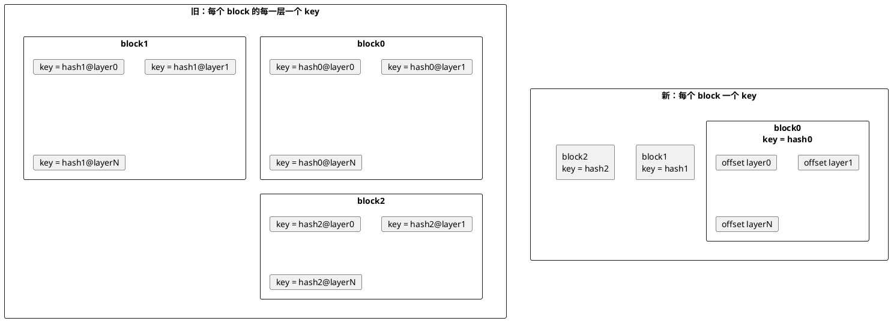
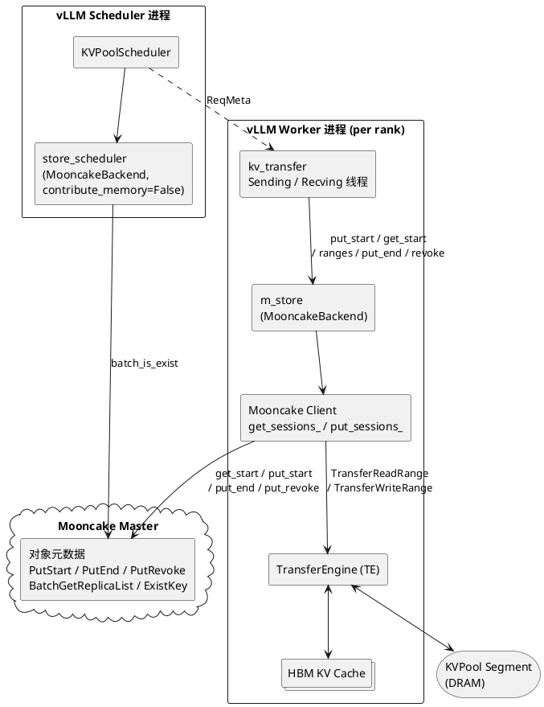
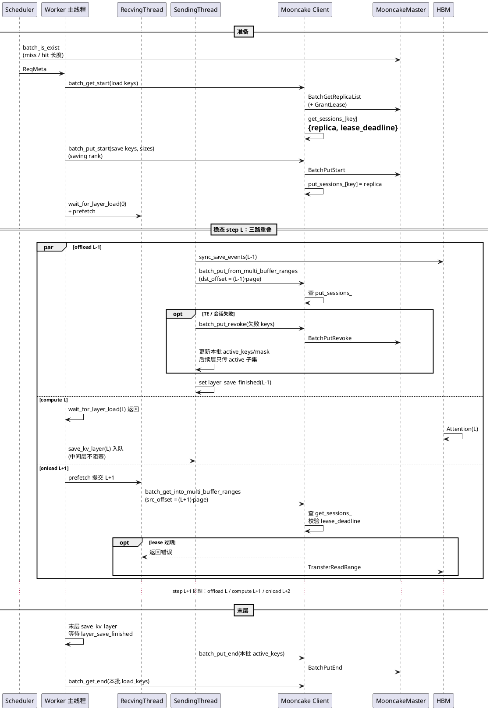

Source: https://hackmd.io/@QQ5HFJZeT1-uFJm16Qaq_Q/HJGESQG4ze
Captured At: 2026-07-20T12:06:39+08:00
Notes: Latest authoritative Mooncake layerwise KVPool put design, including section 5.7 chunked-prefill session lifecycle and lease renewal semantics.

# Mooncake Layerwise KVPool Put 设计文档

## 1. 背景与动机

### 1.1 现状

[vLLM Issue #33398](https://github.com/vllm-project/vllm/issues/33398) 提出 layerwise KV cache onload/offload：推理按层推进，KV 在 HBM 与外接 KVPool 之间异步搬运，以降低 Prefill 阶段 HBM 占用并支撑 prefix cache。实现 PR 为 [vLLM-Ascend PR #10733](https://github.com/vllm-project/vllm-ascend/pull/10733)。

该编排与 KVPool 后端解耦。**memcache** 已支持 layerwise 所需的分配、按址传输与提交语义（见 [PR #11444](https://github.com/vllm-project/vllm-ascend/pull/11444)）。**Mooncake** 在 layerwise 场景尚缺对应的元数据与生命周期接口，无法直接复用该路径。

### 1.2 动机

早期 AscendStore layerwise（KeyLayer）以 **logical block × layer** 为粒度分配 pool key。随着模型层数增加，key 规模与 Master 元数据查询开销按 `blocks × layers` 增长；prefix 命中判定亦需确认各层 key 均已就绪，进一步放大控制面成本。

为此，存储模型调整为 **每个 logical block 对应一个 key**（与 PR #11444 一致）：一次 put 会话预留覆盖全部层的连续空间，各层仅向对应 object-byte offset 写入，写满后对该 key 执行一次 `batch_put_end`。本方案旨在使 Mooncake 复用同一套 layerwise 编排。



### 1.3 目标与非目标

**目标**：为 Mooncake 补齐 layerwise 所需的会话式生命周期与按 offset 批量传输接口，使 vLLM-Ascend 在 `backend=mooncake` 时复用现有 layerwise 编排（per-block key），仅扩展 backend 适配层。

**非目标**：

- 不改变 vLLM attention 层 hook（`wait_for_layer_load` / `save_kv_layer`）契约。
- 不替代 `MooncakeLayerwiseConnector`（PD P2P 逐层推送）；本方案针对 **AscendStoreConnector + KVPool prefix cache**。
- 不要求跨 rank 对称 GVA；对象基址由各 Worker 本进程 Mooncake Client 解析并缓存即可。

### 1.4 设计原则

- **推理优先**：KVPool offload **不得阻塞** HBM forward 热路径；put/get ranges 与 `batch_put_end` / `batch_put_revoke` 在传输线程执行（onload 仍通过 `wait_for_layer_load` 与计算对齐）。
- **Prefix 一致**：未 `batch_put_end` 的对象不参与 prefix hit。
- **会话式地址解析**：Master 交互集中在 `batch_get_start` / `batch_put_start`；按层传输零次 Master，只碰 Client 内缓存。
- **接口批量**：形状对齐现有 multi_buffers（key-major `List[List[int]]`）。
- **最大复用**：沿用 PR #11444 的 layerwise 编排（Scheduler 判 hit + Worker 开会话并按层传输）。

---

## 2. 架构总览

### 2.1 组件职责

沿用 PR #11444：Scheduler 与各 Worker 各自持有 Mooncake Backend（底层各绑一个 Mooncake Client）。

整体划分为 **控制面（元数据）** 与 **数据面（TE）**：

- **控制面**：Scheduler `batch_is_exist`；Worker `batch_get_start` / `batch_put_start` / `batch_put_end` / `batch_put_revoke`；走 Mooncake Master RPC。
- **数据面**：按层 `batch_put_from_multi_buffer_ranges` / `batch_get_into_multi_buffer_ranges`；只走 TransferEngine，**不访问 Master**；Descriptor 查表与 lease 校验在 **Mooncake Client**。



| 组件 | 进程 | 职责 |
|------|------|------|
| `store_scheduler` | Scheduler | `batch_is_exist` → hit 长度；分配 HBM 逻辑 block |
| Mooncake Master | 独立服务 | 对象生命周期、prefix 可见性、读租约 GrantLease |
| `kv_transfer` | Worker | 按层编排 save/load |
| `m_store`（MooncakeBackend） | Worker | 委托 Mooncake Client 会话 API |
| Mooncake Client | Worker | `get_sessions_` / `put_sessions_`：缓存 Replica Descriptor + lease_deadline；ranges 内校验 |
| TE | Worker | HBM ↔ KVPool 按 offset 搬运 |

### 2.2 与现有 put 路径的关系（`backend=mooncake`）

| `use_layerwise` | 路径 | Mooncake API |
|-----------------|------|-----|
| `false` | 整 key put/get | 现网 `put` / `get` / multi_buffers |
| `true`（本方案默认） | 会话 + 按层 ranges | `batch_put_start` + `batch_put_from_multi_buffer_ranges` + `batch_put_end`；load 侧 `batch_get_start` + `batch_get_into_multi_buffer_ranges` + `batch_get_end` |

### 2.3 Block key 对象模型

§2.1 元数据平面管理的对象即 **block key**。对齐 [PR #11444](https://github.com/vllm-project/vllm-ascend/pull/11444) 的 **per-rank / per-put_step-group key**：

| 场景 | key 形态 | 谁 save |
|------|----------|---------|
| MLA（`put_step = tp_size`） | `{model}@{block_hash}@{head_or_tp_rank}`，组内共享 `@0` | 仅 `tp_rank % put_step == 0`（通常 rank0） |
| GQA（`put_step = 1`） | 每 rank 独立 `@{tp_rank}` | 每个 rank 写自己的 key |
| 尾块 | `{model}@{req_id}_lastblock@{head_or_tp_rank}` | 同上 |

每个 key 对应一整块 object（`size = page_size_bytes × num_layers`）；saving rank 按层 ranges 写满后对本 key `batch_put_end`。非每层独立 key。

### 2.4 Backend ABC 统一与后端差异

编排层调 **Backend ABC**。初版原则：**契约一致的同名统一；有硬差异的拆成两个接口**，由 `pool_worker` / `kv_transfer` 按 `backend` 分支调用。

memcache 读路径：`batch_add_lease` / `batch_remove_lease`。Mooncake 读路径：`batch_get_start` / `batch_get_end`（descriptor 与 lease 由 Client 在会话内维护，§4）。

#### 能统一（同名 override）

| ABC 方法 | memcache | MooncakeBackend → Client | 说明 |
|----------|----------|--------------------------|------|
| `batch_commit(keys)`（新增） | 空实现（holes 挖空即可读） | `batch_put_end` | 写侧发布 COMPLETE |
| `batch_revoke(keys)`（新增） | 空实现（初版） | `batch_put_revoke` | `batch_copy_put` 失败的 key 放弃写会话 |
| `batch_is_exist` / `exists` | 已有 | 已有 | 元数据查询 |

#### 初版拆开

| 差异点 | memcache 侧 ABC | Mooncake 侧 ABC | 原因 |
|--------|-----------------|-----------------|------|
| 写预留 | `batch_alloc(keys, sizes) -> list[int]`（返回 **GVA**） | `batch_put_start(keys, sizes) -> list[int]`（返回 **状态码**） | 返回值语义不同 |
| 按层写 | `batch_copy(..., direction=TO_POOL)`（GVA 寻址） | `batch_copy_put(keys, buffers, sizes, dst_offsets)` | 入参形状不同 |
| 按层读 | `batch_copy(..., direction=FROM_POOL)` | `batch_copy_get(keys, buffers, sizes, src_offsets)` | 入参形状不同 |
| 读开会话 | `batch_add_lease`（+ 可选 `batch_get_key_info`） | `batch_get_start` | memcache 显式租约；Mooncake 开会话（§4） |
| 读收尾 | `batch_remove_lease` | `batch_get_end` | 两端收尾语义不同 |
| Scheduler hit | `batch_get_key_info` | `batch_is_exist` | 是否需要 GVA |

ABC / `MooncakeBackend` 用短名；Client 长名只在 Backend 内委托：`batch_copy_put` → `batch_put_from_multi_buffer_ranges`，`batch_copy_get` → `batch_get_into_multi_buffer_ranges`。

```text
kv_transfer / pool_worker
  ├─ 统一：batch_commit / batch_revoke / batch_is_exist
  └─ 按 backend 分支：
       memcache  → batch_alloc / batch_copy / batch_get_key_info
                   / batch_add_lease / batch_remove_lease
       mooncake  → batch_put_start / batch_copy_put / batch_copy_get
                   / batch_get_start / batch_get_end
```

---

## 3. 端到端时序



#### Save 收尾（commit / revoke）

两层集合，职责分开（对齐现网 load 按本批 `req_meta.load_keys` 放租约，而非全局表）：

| 集合 | 生命周期 | 用途 |
|------|----------|------|
| `_put_started_keys`（`pool_worker`，进程级） | 跨 step 累积 | **仅** `put_start` 幂等；`end`/`revoke` 后移除 |
| `active_keys`（SendingThread，**本批任务**） | 随本批 `SharedBlockData.block_keys` 初始化 | 本批 ranges；末层只 commit 这里面还剩的 |

现网 `_build_shared_save_data` 把**同一份**只读 `SharedBlockData` 挂到全部 `layer_save_tasks`，不能靠改 shared 跳过失败 key。层失败过滤落在 SendingThread 的可变 `active_keys`（或与 `block_ids_arr` 对齐的 `active_mask`）。写预留失败过滤在 `pool_worker` 写预留之后、`build_shared` 之前（两端共用；相对现网 memcache「alloc 失败仍带坏 GVA 进 copy」的改进）。

| 事件 | 调用方 | 动作 |
|------|--------|------|
| 预留成功 | `pool_worker` | memcache 记 GVA / Mooncake 记 `_put_started_keys`；纳入本批 shared |
| 预留失败 | `pool_worker` | 跳过该 key（`gva <= 0` / `put_start` 非 0 → 不进 shared / 不进 copy） |
| 本批 save 开传 | SendingThread | `active_keys = shared.block_keys`（可变；shared 本身不改） |
| 每层传输 | SendingThread | 仅 active 子集 `build_addrs` + copy_put |
| 某层 copy_put 失败 | SendingThread | 立即 `batch_revoke`；更新 `active_keys`；移出 `_put_started_keys` |
| 末层收尾 | SendingThread | `batch_commit(active_keys)`；未收尾 PROCESSING 靠超时 |

memcache 侧 `commit`/`revoke` 为空实现；若某层 `batch_copy` 部分失败，可用同一 `active_mask` 跳过后续层（可选，与 Mooncake 同构）。

---

## 4. Mooncake 改动

本节描述 **mooncake-wheel / Client** 需新增与扩展的能力。Master 尽量不改：复用 `BatchGetReplicaList`（带 lease）、`BatchPutStart` / `BatchPutEnd` / `BatchPutRevoke`。底层 get 复用 `TransferReadRange`；put 新增对称的 `TransferWriteRange`。

### 4.1 改动总览

| 模块 | 改动 |
|------|------|
| `mooncake-wheel` / PyClient | 暴露 §4.3 会话 API |
| Mooncake Client（C++） | `get_sessions_` / `put_sessions_` hashmap；lease 截止时刻校验 |
| `MasterClient` | 复用现网 BatchPut* / BatchGetReplicaList |
| Transfer | 新增 `TransferWriteRange`；get 用现有 `TransferReadRange` |

对象生命周期与会话隔离见 §4.2 / §4.3；读租约见 §4.4。

### 4.2 Client 内部会话

```text
get_sessions_: map<key, {replica_descriptor, lease_deadline, ...}>
put_sessions_: map<key, {replica_descriptor, ...}>
```

- 会话仅对本 Client 进程有效（与 memcache per-process tracker 同理）。
- ranges API：**禁止**在 miss / expired 时内部再 Query Master。
- 整 key `put` / `get` / `get_into_ranges`（Engram）与会话 map **分离**，互不复用。

### 4.3 Store 接口定义

约定：

- `keys[i]` 与 `all_buffers[i]` / `all_sizes[i]` / `all_src_offsets[i]` / `all_dst_offsets[i]` **一一对应**（与现有 multi_buffers 相同）。
- `all_buffers[i]`：该 key 本跳要传的一组已 `register_buffer` 的本地指针。
- **offset = 对象内字节偏移**，不是 layer id；layerwise 由 Backend / `LayerBatchBuilder` 计算 `layer_id * page_size`（及 K/V 内偏移）。
- 返回值：与 keys 对齐的 `List[int]`；成功为 `0` 或正字节数（按现有 multi_buffers 约定），负为错误码。

#### 4.3.1 Load 会话

```python
def batch_get_start(
    keys: List[str],
) -> List[int]:
    """
    一次 Master：BatchGetReplicaList（带读租约，TTL 为 Client / Master 默认 `default_kv_lease_ttl`）。
    Client 按 key 缓存 memory-backed Replica::Descriptor，
    并记录 lease_deadline = now + default_kv_lease_ttl。

    Args:
      keys: 对象 key 列表。

    Returns:
      与 keys 等长。0 = 已缓存可 ranged 读；负 = 不存在 / 未 complete / 无 memory replica 等。
    """

def batch_get_into_multi_buffer_ranges(
    keys: List[str],
    all_buffers: List[List[int]],
    all_sizes: List[List[int]],
    all_src_offsets: List[List[int]],
) -> List[int]:
    """
    零次 Master。用 get_start 缓存的 descriptor 做 ranged 读。

    语义（对每个 key i、每个 buffer j）:
      读  object[ all_src_offsets[i][j] : + all_sizes[i][j] ]
      写入 all_buffers[i][j]

    约束:
      - 每个 key 必须已成功 batch_get_start 且会话未 end；
      - now > lease_deadline → 该 key 失败（租约过期），禁止再 Query Master；
      - miss → 失败，禁止再 Query Master；
      - 对象须 memory-backed。

    Returns:
      与 keys 等长；成功为读出字节数（或约定成功码），失败为负错误码。
    """

def batch_get_end(keys: List[str]) -> int:
    """
    删除内部 get-session cache。
    若 Master 支持提前释放读租约则一并释放；否则仅丢本地 cache，等 TTL。

    Returns:
      0 成功；负为错误。
    """
```

#### 4.3.2 Save 会话

```python
def batch_put_start(
    keys: List[str],
    sizes: List[int],
) -> List[int]:
    """
    一次 Master：BatchPutStart。
    Client 缓存可写 Replica::Descriptor；不向 Python 返回 buffer_address。

    Args:
      keys: 对象 key。
      sizes: 与 keys 对齐；layerwise 通常为 page_size * num_layers。

    Returns:
      与 keys 等长；0 = 已预留并可 ranged 写；负 = 失败。
    """

def batch_put_from_multi_buffer_ranges(
    keys: List[str],
    all_buffers: List[List[int]],
    all_sizes: List[List[int]],
    all_dst_offsets: List[List[int]],
    config: Optional[ReplicateConfig] = None,
) -> List[int]:
    """
    零次 Master。用 put_start 缓存的 descriptor 做 ranged 写。

    语义（对每个 key i、每个 buffer j）:
      写  object[ all_dst_offsets[i][j] : + all_sizes[i][j] ]
      ←   all_buffers[i][j]

    约束:
      - 每个 key 必须已成功 batch_put_start 且未 put_end；
      - miss → 失败，禁止内部再 PutStart；
      - 底层走 TransferWriteRange。

    Returns:
      与 keys 等长；成功为写入字节数（或约定成功码），失败为负错误码。
    """

def batch_put_end(keys: List[str]) -> List[int]:
    """
    一次 Master：BatchPutEnd → 对象 COMPLETE、可读。
    删除内部 put-session cache。

    Returns:
      与 keys 等长；0 成功，负失败。
    """

def batch_put_revoke(keys: List[str]) -> List[int]:
    """
    取消未 complete 的 put（BatchPutRevoke），并清理 Client put-session。
    用于 batch_copy_put / ranged 写失败后的 key；不对已 put_end 的 key 调用。
    未 revoke、未 put_end 的 PROCESSING 由 Master 超时清理。
    """
```

### 4.4 Lease 语义

| 点 | 说明 |
|----|------|
| 何时与 Master 交互设 lease | `batch_get_start`（底层 `BatchGetReplicaList` → `GrantLease`） |
| Client 本地 | 记录 `lease_deadline`；ranges 用 `now` 与之比较，过期返回错误 |
| Scheduler `batch_is_exist` | 仅用于 hit 长度判定 |
| TTL | Client / Master 默认 `default_kv_lease_ttl`；须能覆盖分层 onload，不足则调 Master 配置 |
| 会话收尾 | `batch_get_end` 清理 `get_sessions_`（并可在 Master 支持时提前放租约） |

---

## 5. vLLM-Ascend 改动

ABC 契约见 **§2.4**；Mooncake Client 见 **§4**。

### 5.1 开关

沿用 `use_layerwise` + `backend`。门控 `use_gva_layerwise` 改名为 `use_block_key_layerwise`：仅表示 **per-block-key** 编排，不暗示 GVA。connector / scheduler / worker 三处同步改名。

| `use_layerwise` | `backend` | 路径 |
|-----------------|-----------|------|
| `false` | 任意 | 现网整 key put/get |
| `true` | `memcache` | per-block-key + GVA + `batch_copy`（`Layer*Thread`） |
| `true` | `mooncake` | 本方案：per-block-key + 会话 ranges（`Layer*Thread`） |
| `true` | `yuanrong` 等 | **仍走** `KVCacheStoreKeyLayer*Thread`（每层一 key）；本方案不升级 |

### 5.2 `backend/backend.py`（ABC）

方法集合与语义见 **§2.4**。落点：

- 新增 `batch_commit` / `batch_revoke`：默认成功空实现（`[0] * len(keys)`）
- 新增 Mooncake 专用：`batch_put_start` / `batch_get_start` / `batch_get_end` / `batch_copy_put` / `batch_copy_get`；ABC 默认 `NotImplementedError`

### 5.3 `memcache_backend.py`

- `batch_commit` / `batch_revoke` → `[0] * len(keys)`
- 既有 alloc / copy / lease / `batch_get_key_info` 保持现状

### 5.4 `mooncake_backend.py`

薄封装：按 §2.4 委托现有 `store`（Client）；会话状态在 Client（§4.2）。各方法先 `_ensure_initialized()`；负错误码透传；整 key `put`/`get` 与 ranges 会话路径分离。

```python
def batch_copy_put(self, keys, all_buffers, all_sizes, all_dst_offsets) -> list[int]:
    self._ensure_initialized()
    assert self.store is not None
    return self.store.batch_put_from_multi_buffer_ranges(
        keys, all_buffers, all_sizes, all_dst_offsets
    )
```

### 5.5 编排层（`pool_worker.py` + `kv_transfer.py`）

Save 收尾 / `active_keys` 语义见 **§3**；Backend 分支见 **§2.4**。此处只写本文件落点。

| 文件 | 负责 |
|------|------|
| `pool_worker` | 按 `use_block_key_layerwise` 选用 `Layer*Thread`；写预留 / 读开会话、`build_shared`；load 末层 `get_end` / `remove_lease` |
| `kv_transfer` | 按层 copy（memcache：`batch_copy`；Mooncake：`batch_copy_put` / `batch_copy_get`）；Mooncake `active_keys` 过滤；末层 `batch_commit`；失败 `batch_revoke` |

```text
process_layer_data（单 step / 单 chunk 骨架）:
  memcache: batch_alloc / add_lease(+get_key_info)
  mooncake: batch_put_start / batch_get_start
  → build_shared → 逐层 copy → 末层 commit / get_end|remove_lease
```

`_put_started_keys` 对齐 `_allocated_gvas`：**只做** `put_start` 幂等；成功才进本批 `block_keys`；end/revoke 后移除。

#### Save 侧 key 元数据管线

现网 `_alloc_gvas_for_save`：Worker **现场**拼 key → `batch_alloc` → 只把 **GVA** 写入 `ReqMeta.block_gvas_np`；`build_shared` 只读 GVA。Mooncake 无 GVA，`build_shared` 必须拿到与 `block_ids` **对齐**的 key。

定案（key 形态见 §2.3）：

1. **`ReqMeta` 增加**与 save 范围对齐的 `save_block_keys`（可与 `block_gvas_np` 同 offset 语义）。`put_start` **成功**的 key 写入该字段；失败的跳过（见 §3）。
2. **`build_shared`（Mooncake）**从 `ReqMeta.save_block_keys`（+ load 侧对应字段）填 `SharedBlockData.block_keys`，与 `block_ids_arr` 一一对应。
3. **不要用** Scheduler `generate_keys` 做 put/ranges：其产出无 `@head_or_tp_rank`，与 Worker 真实 object key 不一致；save 路径以 Worker 为准。

**传输限流**：memcache 走 `_batch_copy_with_limits`。Mooncake **初版不分片**（风险见 §7）；后续可按同一 split 语义切 key。

#### `SharedBlockData` / `LayerBatchBuilder`

对照现网（11444）：`build_shared` 预计算跨层不变的 `block_ids_arr` + `block_gvas_arr`；`build_addrs(layer_id)` 再算  
`gvas = base_gva + layer_id * page_size + inner_offsets`，以及本地 `addr`/`size`（按 `_caches_per_layer` 展开 K/V 等多段），供 `batch_copy`。

初版双轨：memcache 保持 flat GVA；Mooncake 走 key-major。

```python
@dataclass
class SharedBlockData:
    block_ids_arr: np.ndarray
    # memcache:
    block_gvas_arr: np.ndarray | None
    # mooncake：与 block_ids_arr 对齐的 object key（每 logical block 一个）
    block_keys: list[str] | None
    req_ids: list[str]
    is_last_chunks: list[bool | None]
    load_keys: list[str]  # 读收尾用

# Mooncake build_addrs(layer_id) → 供 batch_copy_put / batch_copy_get
# keys[i]              = shared.block_keys[i]
# all_buffers[i][j]    = layer 本地 ptr：base_addr[j] + block_id * stride[j]
# all_sizes[i][j]      = layer_block_len[j]
# all_*_offsets[i][j]  = layer_id * page_size_bytes + layer_inner_offsets[j]
#   j ∈ [0, caches_per_layer)  （与现网 _build_transfer_arrays 的 K/V 多段一致）
# save → all_dst_offsets；load → all_src_offsets
```

### 5.6 `pool_scheduler.py`

门控见 **§5.1**；key / `alloc_size` 见 **§2.3**。本文件仅改 Scheduler 侧：

1. `use_gva_layerwise` → `use_block_key_layerwise`（与 connector / worker 同名）。
2. hit：memcache 仍走 `batch_get_key_info`；Mooncake 走 `batch_is_exist`（PROCESSING 不可见，无需 GVA）。
3. hit 查询的 key 须带 `@head_or_tp_rank`（与 Worker 一致）；**不要**用无 rank 后缀的 `generate_keys` 结果做 Mooncake layerwise hit。

### 5.7 Chunked Prefill：会话 API 挂点

Chunked Prefill 下，Scheduler 按请求做 `batch_is_exist` / 生成 `ReqMeta`；chunk 循环在 Worker。

| API | 调用粒度 | 挂点 | 说明 |
|-----|----------|------|------|
| `batch_get_start` | 每 chunk（需 load 时） | 进入该 chunk、按层流水之前 | `load_keys` = 此前已 `put_end` 的 keys ∪ 本 chunk 需 load 的 keys（含 prefix hit） |
| `batch_put_start` | 每 chunk（saving rank） | 同 chunk、get_start 之后 | 本 chunk `save_keys`；`size = page × num_layers` |
| `batch_put_end` | 每 chunk（saving rank） | 本 chunk 末层 `copy_put` 完成之后 | 本 chunk → COMPLETE |
| `batch_get_end` | 仅 last chunk | `is_last_chunk` 且本 chunk 最后一层 onload 完成之后 | 释放租约，允许 blocks 淘汰 |

每 chunk `batch_get_start` 传入上述全量 `load_keys` 时，Mooncake 对已有租约续约、对无租约的 key 新加租约。

```text
Scheduler: exist + ReqMeta（请求一次）
Worker chunk Ci:
  get_start(前缀∪本 chunk load_keys)
  put_start(本 chunk save_keys)
  for L: onload L+1 ‖ compute L ‖ offload L-1
  if is_last_chunk: get_end(累计 load_keys)   # 最后一次 onload 之后
  put_end(本 chunk active_keys)
```

---

## 6. 测试计划

### 6.1 Mooncake

仓库：`Mooncake-upstream`。

| 落点 | 内容 |
|------|------|
| Client 集成测试 | `batch_put_start`：成功进 `put_sessions_`；PROCESSING 期间 Exist/GetReplica 不可见；冲突错误码 |
| Client 集成测试 | `batch_put_end`：COMPLETE 后可被 get_start 命中；幂等；清 put_sessions_ |
| Client 集成测试 | `batch_put_revoke`：PROCESSING 释放后可再 start；已 COMPLETE 不可 revoke |
| Client 集成测试 | `batch_get_start` + ranges：缓存 descriptor；按默认 TTL 写入 deadline；过期后 ranges 失败且不二次 Query |
| Client 集成测试 | `batch_get_end`：清 get_sessions_ |
| Transfer 测试 | `TransferWriteRange` / ranged 写：`size < object_size` 多段写入；与整 key put 的 `validateTransferParams` 隔离 |
| `mooncake-wheel` | Python：`batch_put_start` → 多层 `batch_put_from_multi_buffer_ranges` → `batch_put_end` → `batch_get_start` → `batch_get_into_multi_buffer_ranges` → `batch_get_end`；失败 `batch_put_revoke` |

### 6.2 vLLM-Ascend

沿 PR #11444 的 `tests/ut/distributed/ascend_store/` 范围扩展。

| 文件 | 本方案需补充 |
|------|-------------|
| `test_pool_scheduler.py` | `backend=mooncake` 走 `batch_is_exist` 判 hit |
| `test_pool_worker.py` | `batch_get_start` / `batch_put_start`；结束 `batch_get_end` / `batch_put_revoke` |
| `test_kv_transfer.py` | `batch_copy_put` / `batch_copy_get`；末层 `batch_put_end`；写失败 `batch_put_revoke`；lease 过期记失败块 |
| `test_backend.py` | `MooncakeBackend`：`batch_get_start` / `batch_copy_*` / `batch_get_end` 委托 Client；`MemcacheBackend`：`batch_commit` / `batch_revoke` 为空实现 |
| `_mock_deps.py` | mock Client 会话 API |

#### 联调与 E2E

NPU + Mooncake：prefix hit 与 accuracy；长 load 场景验证默认 `default_kv_lease_ttl` 是否足够、以及过期后的失败降级。

---

## 7. 风险与开放问题

- **Mooncake 初版不分片**：大 batch 时 TE 压力高于 memcache 限流路径；若成瓶颈，再复用 `max_transfer_*` 语义按 key 分片。
- **SSD 与 layerwise**：本方案假定 layerwise 对象落在 memory replica；ranges 要求 memory-backed；是否与 SSD offload 并用由 vLLM 配置约束。
- **lease 覆盖时长**：单 chunk 内默认 TTL 须覆盖分层 onload；多 chunk 依赖每 chunk `batch_get_start` 续约（§5.7）。若中途 `get_end` 或续约失败导致被淘汰，后 chunk onload 失败，由 vLLM fallback 重算。
- **单 writer 时延**：MLA 下 pool 写由 saving rank 承担，可能拉长 SendingThread 上 ranges 耗时；不阻塞中间层 forward，但末层 `batch_put_end` 前的排队仍需观察。
- **`batch_put_end` / `batch_put_revoke` 占用 SendingThread**：同步 Master RPC，初版在 SendingThread 内调用，可能拖住后续 TE；若成为瓶颈，再拆独立控制面线程或队列。
- **双端查询窗口**：Scheduler `batch_is_exist` 与 Worker `batch_get_start` 之间对象可能被 eviction；get_start miss 或随后 lease 过期均按 load 失败处理。

---

## 8. 备选方案与选型

layerwise 要求在 PutStart 之后、PutEnd 之前，对同一 object 多次写入不足整块的数据。现网整 key `put` 经 `validateTransferParams` 校验，要求单次传输写满整块，无法直接复用。

### 8.1 放宽 `validateTransferParams`

在现网 `put` 路径上允许单次传输写不满整块。

**不采用。** 整 key `put` 的语义是一次写满对象；放宽校验会破坏该契约。

### 8.2 会话 + ranged 传输（本方案）

`batch_put_start` / `batch_get_start` 缓存 Descriptor 于 Mooncake Client；按层 `TransferWriteRange` / `TransferReadRange`。

**采用。** 与 memcache「一次解析地址、按层搬运」同构；Master 改动最小；Python 不接触远端地址；lease 与查表留在 Client，编排层只碰 key / 本地 ptr / object offset。

### 8.3 vLLM 直连 `global_te`

**不采用。** 段管理、错误码与会话生命周期应留在 Mooncake Client / store 域。
