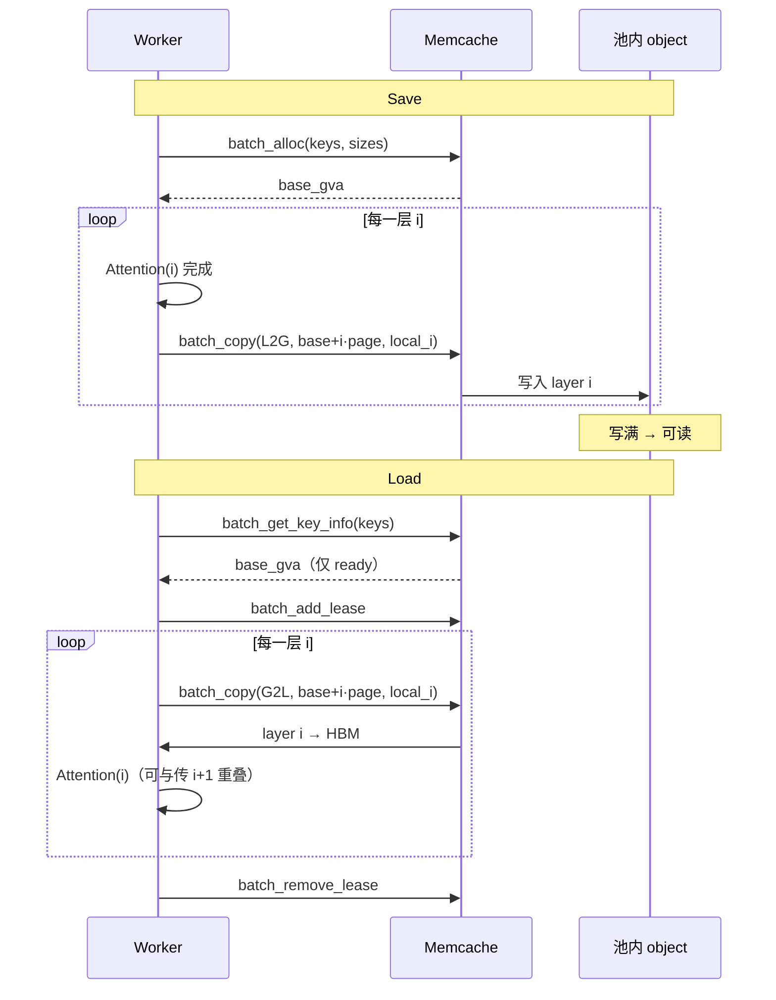
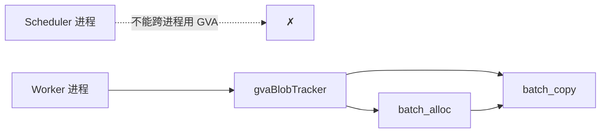
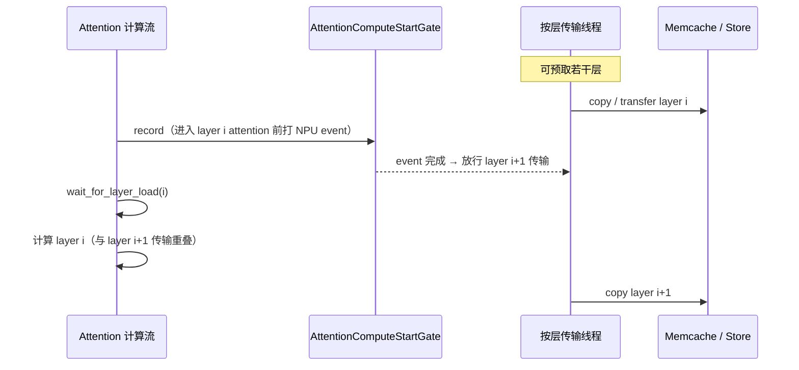
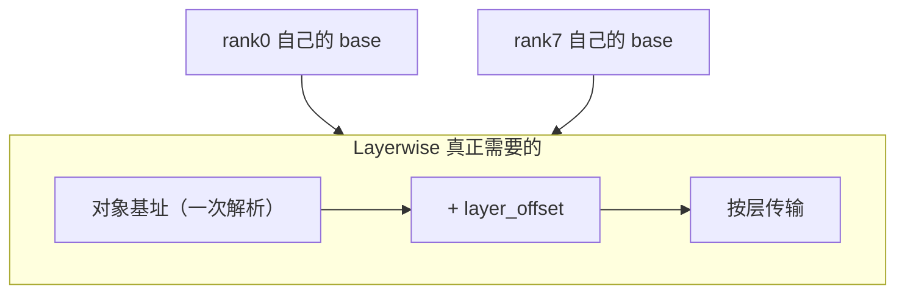

Source: https://hackmd.io/@QQ5HFJZeT1-uFJm16Qaq_Q/rJDGRCpXGg
Captured At: 2026-07-14T09:52:57+08:00
Notes: Updated authoritative design snapshot covering Layerwise KV Pool principles and Mooncake session-based ranged read/write adaptation.

# Mooncake + HIXL 支持 Layerwise KV Cache 池化
---

## 0. 一句话结论

Layerwise 的核心不是 GVA，而是三件事：

1. **一块一个 key、跨层连续存放**（`base + layer_offset` 定位某一层）
2. **地址只解析一次**，之后按层搬运，不再每次走 key → 元数据
3. **按层传输与 Attention 计算重叠**（fence / 预取控制并发）

memcache 用 GVA + `batch_copy` 实现了「地址化按层搬运」；Mooncake 的 `batch_put` / `batch_get` 本身就会在 store 侧申请/定位内存，每个 rank 拿到自己的对象地址后往里写就行。**跨 rank 对称的全局虚址（GVA）不是 layerwise 的前提。**

---

## 1. 背景：为什么要 Layerwise

非 layerwise 路径：整段 KV（所有层）攒齐再一次性 put/get。长序列下，传输堵在 Attention 前面，TTFT 被拉长。

Layerwise：算完 / 要用某一层，就立刻传那一层，传输与下一层计算重叠。#11444 在 32k 输入、90% 命中下，TTFT 从 ~149s 降到 ~64s（接近 HBM 命中）。

---

## 2. Memcache Layerwise 机制（完整说明）

下面按「数据怎么放 → 怎么申请 → 怎么传 → 怎么和计算重叠 → 正确性约束」把 memcache 路径说清楚。先不谈 Mooncake。

### 2.1 对象布局与 Key

把 KV 想成一张表：**行 = layer，列 = block**。

**旧设计**：每个格子一把 key（每层每块各存一次）→ key 数 ≈ `num_layers × num_blocks`。

```text
              block0        block1        block2
            ┌────────┐    ┌────────┐    ┌────────┐
  layer0    │ key₀₀  │    │ key₀₁  │    │ key₀₂  │
            └────────┘    └────────┘    └────────┘
            ┌────────┐    ┌────────┐    ┌────────┐
  layer1    │ key₁₀  │    │ key₁₁  │    │ key₁₂  │
            └────────┘    └────────┘    └────────┘
            ┌────────┐    ┌────────┐    ┌────────┐
  layer2    │ key₂₀  │    │ key₂₁  │    │ key₂₂  │
            └────────┘    └────────┘    └────────┘
                 ·              ·              ·
```

**Layerwise**：同一列（同一个 block 的所有层）合成**一把 key、一块连续 object**；层不再进 key，只用偏移切。

```text
              block0              block1              block2
         ┌─────────────────┐ ┌─────────────────┐ ┌─────────────────┐
  layer0 │  K|V            │ │  K|V            │ │  K|V            │
  layer1 │  K|V            │ │  K|V            │ │  K|V            │
  layer2 │  K|V            │ │  K|V            │ │  K|V            │
    ·    │  ·              │ │  ·              │ │  ·              │
  layerN │  K|V            │ │  K|V            │ │  K|V            │
         └────────┬────────┘ └────────┬────────┘ └────────┬────────┘
                  │                   │                   │
             一把 key            一把 key            一把 key
         model@hash0@g        model@hash1@g        model@hash2@g
         连续存放，size =     连续存放               连续存放
         page × num_layers
```

池内这一列的物理排布（按层紧挨着）：

```text
  base ──► ┌──────────────┐
           │ layer0  K|V  │  page_size
           ├──────────────┤
           │ layer1  K|V  │  base + 1·page
           ├──────────────┤
           │ layer2  K|V  │  base + 2·page
           ├──────────────┤
           │     ...      │
           ├──────────────┤
           │ layerN  K|V  │  base + N·page
           └──────────────┘
  传第 i 层：只搬 [base + i·page, page_size]，不改 key
```

Key 公式：

```text
key   = f"{model}@{block_hash}@{tp_rank // put_step}"
size  = page_size_bytes * num_layers
addr(layer i) = base + i * page_size_bytes
```

#### Key 里的 `tp_rank // put_step` 是什么

上面「一列 = 一把 key」是对**单个 rank 视角**说的。多卡时还要决定：几张 TP 卡共享这一列。

`put_step` = 多少张卡共享**同一份** KV；`tp_rank // put_step` 得到组号，写进 key 后缀：

```text
MLA（put_step=8）：8 卡同一份 latent
  rank0 ─┐
  rank1 ─┤
  ...    ├─► tp_rank//8 = 0 ─► 同一把 key ...@0
  rank7 ─┘                      只有 rank0 写池（tp_rank % 8 == 0）
                                其余卡读同一列

GQA（put_step=1）：每卡一份
  rank0 ─► ...@0   各自一列、各自一把 key
  rank1 ─► ...@1
  rank7 ─► ...@7
```

| 场景 | put_step | `tp_rank // put_step` | 谁写池 | 池里几份 |
| :--- | :---: | :--- | :--- | :---: |
| MLA TP=8 | 8 | 全是 `0` → 同一把 key | 仅 rank0 | 1 |
| GQA | 1 | 等于 `tp_rank` → 每卡一把 key | 每卡各自 | TP 份 |

### 2.2 地址面：GVA 在 memcache 里扮演什么角色

memcache 建在 FabricMem / 对称内存之上，对外暴露 **GVA（Global Virtual Address）**：

- `batch_alloc(keys, sizes)`：为 key 在池里申请一块连续内存，返回起始 GVA。
- `batch_get_key_info(keys)`：对象写完后，返回可读的起始 GVA（未写完则无效，避免假命中）。
- `batch_copy(gva, local, size, dir)`：按地址在本地 HBM 与池之间拷贝，**不再解析 key**。



**GVA 的本质**：超节点内各 rank 看到的是同一套对称虚址空间，任意卡可以用同一个数字当指针去 `batch_copy`。这是 memcache 传输底座的实现选择，不是 layerwise 语义本身。

对 layerwise 真正有用的，是「**拿到对象基址后，用偏移切层**」——基址是不是跨 rank 对称的 GVA，还是本 rank 解析出来的本地 VA / segment+offset，都可以。

#### 没有 `put_end`：按层填 hole，洞清零才 READABLE

Mooncake 用显式 `PutEnd` 宣布可读；memcache **没有**对应 API。可读性靠：

```text
batch_alloc          → blob = ALLOCATED，整段登记为一个大 hole
batch_copy(L2G, 一段) → 拷数据 + ConsumePendingHole（挖掉这段）
                     → holes 仍非空：继续可写，对外仍不可读
                     → holes 空了：NotifyUpdate(MMC_WRITE_OK) → READABLE
```

跨层一个大 blob（`size = page × num_layers`）时，**第一次** `batch_copy` 只填一层，不会整对象变可读：

```text
batch_alloc 之后（ALLOCATED，整段都是 hole）

  base ──► ┌──────────────────────────────────────┐
           │████████████  hole（未写）  ████████████│  [base, base+N·page)
           └──────────────────────────────────────┘
  meta / get_key_info：无有效可读 GVA（或非 READABLE）


Attention(0) 完 → batch_copy(L2G, base+0·page, page)
  ConsumePendingHole 挖掉 layer0

  base ──► ┌────────┬─────────────────────────────┐
           │ layer0 │████████  hole 仍在  ████████│
           │  已写  │                             │
           └────────┴─────────────────────────────┘
  状态仍是 ALLOCATED（holes ≠ ∅）→ 别人不能当 hit 来读


Attention(1) 完 → batch_copy(L2G, base+1·page, page)
  …

  base ──► ┌────────┬────────┬────────────────────┐
           │ layer0 │ layer1 │████ hole █████████│
           └────────┴────────┴────────────────────┘


… 写到最后一层，holes 清零

  base ──► ┌────────┬────────┬─────┬────────┐
           │ layer0 │ layer1 │ ... │ layerN │
           └────────┴────────┴─────┴────────┘
  MarkWriteSuccess + meta：ALLOCATED + WRITE_OK → READABLE
  此后 batch_get_key_info 才返回有效 base_gva
```

实现落点（client 本地 tracker + meta）：

```text
RegisterFromBatchAlloc
  holes = { [blob.gva, blob.gva + size) }     // 一整段未写

每次 batch_copy 写成功
  ConsumePendingHole(gva, size)               // 从 holes 里抠掉本次区间
  if remainingHoleCount == 0:
      NotifyUpdateBlobByGva(MMC_WRITE_OK)     // ≈ Mooncake PutEnd
      MarkWriteSuccess → READABLE
  else:
      保持 ALLOCATED，继续等后续层
```

所以 #11444 要求 **整对象按层写满、禁止只写一部分就当完成**：少写一层会永远留 hole，读侧要么拿不到有效 GVA，要么踩 `ConsumePendingHole` / 假命中（`batch_is_exist` 在 alloc 后就为真，必须用 `batch_get_key_info`）。

### 2.3 为什么 alloc 必须在 worker 进程

memcache 的 `gvaBlobTracker` 是 **per-process** 的：`batch_alloc` 登记的 blob，只有同一进程里的 `batch_copy` 认。所以 #11444 把 GVA 分配从 scheduler 挪到 worker，在真正拷贝前由本进程 `batch_alloc`，并缓存到 `_allocated_gvas`（只缓存成功项，`gva > 0`）。



### 2.4 按层传输与计算重叠

框架侧（与后端无关的编排）：

| 机制 | 作用 |
| :--- | :--- |
| 按层 save/load 线程 | 算完 layer i 立刻 save；load 时 layer i+1 传输与 layer i 计算重叠 |
| `AttentionComputeStartGate` | 用 NPU event 对齐「计算流真正到 attention 边界」再放行传输，避免只按 Python 调用点抢占 |
| 预取 / 批量上限 / 错峰 | `layerwise_prefetch_layers`、`layerwise_max_transfer_*`、`h2d_stagger_us` |



### 2.5 #11444 五项优化分别落在哪

| # | 优化 | 实质 |
| :-- | :-- | :-- |
| 1 | 统一 Key | 块级 key + 层偏移（框架侧） |
| 2 | 一次性地址解析 | alloc / get_key_info 一次，之后 `base+offset` |
| 3 | 地址化 `batch_copy` | 跳过每次 key 解析 |
| 4 | NumPy 算本地 HBM 地址 | 框架侧，与后端无关 |
| 5 | comm fence / 预取 | 框架侧，与后端无关 |

1/4/5 与后端无关；2/3 是「先拿到基址，再按地址切层传」——memcache 用 GVA 实现，其它后端可以用自己的地址表示实现同样语义。

---

## 3. GVA 到底重不重要？

### 3.1 你的理解（本文采纳）

1. **Layerwise 要的是「对象基址 + 层偏移」**，不是「全机统一的同一个数字」。
2. memcache 的 `batch_alloc` 本质是 **在池里申请一块跨层连续内存并返回可写基址**；Mooncake 的 `batch_put` / PutStart 路径里，store 侧本来就会为 object 分配 slice / buffer——申请内存这一步并不稀缺。
3. 传输时，每个 worker 只需要能对自己拿到的远端地址（或 segment+offset）发起 HIXL 一侧读写；**不要求** rank0 和 rank7 看到同一个虚址字面量。

因此：文档和实现里不应把「必须上 GVA / FabricMem 对称编址」写成 layerwise 的硬门槛。



---

## 4. Mooncake Layerwise 方案


### 4.1 设计原则

1. **会话式**：`start` 时 Store/Client 内部 cache replica；`end` 时删除。Python 只碰 key、已 register 的本地 ptr、object-byte offset。
2. **按层传输用独立 API，不复用 `get_into_ranges`**：后者是 Engram 多 fragment stitch（3D、单次临时 cache），与「跨多层异步会话」不是一类问题。底层可共用 `TransferReadRange` / 新增 `TransferWriteRange`。
3. **形状对齐现有 multi_buffers**：`List[List[int]]`，key-major，与 `batch_get_into_multi_buffers` / `batch_put_from_multi_buffers` 一致，再加 `*_offsets`。
4. **Master 尽量不改**：复用 `BatchGetReplicaList`（带 lease）、`BatchPutStart` / `BatchPutEnd`。

---

### 4.2 已有 vs 新增

| | 已有 | 本方案 |
| :--- | :--- | :--- |
| 整对象读写 | `batch_get_into_multi_buffers` / `batch_put_from_multi_buffers` | 非 layerwise 继续用 |
| 多 fragment stitch | `get_into_ranges`（C++ 可带临时 cache） | **不动**；Engram 继续用 |
| 按 offset 读 | `TransferReadRange` | get 会话每跳调用 |
| 按 offset 写 | 缺对称 range write | **新增** `TransferWriteRange` |
| Put 预留 / 提交 | Master `BatchPutStart/End` | Client/Python **暴露**为 put 会话 |
| 读元数据 + 租约 | `BatchQuery` / `GetReplicaList` | 收进 **`batch_get_start`**，不给 Python 玩 cache |

---

### 4.3 Store 接口定义（完整）

以下为 Python / `PyClient` 对外签名。C++ `Client` / `RealClient` 同语义。

约定：

- `keys[i]` 与 `all_buffers[i]` / `all_sizes[i]` / `all_*_offsets[i]` **一一对应**（与现有 multi_buffers 相同）。
- `all_buffers[i]`：该 key 本跳要传的一组已 `register_buffer` 的本地指针（典型：该层 K、V 各一块，或 TP 切分后的多段）。
- `all_sizes[i][j]` / `all_*_offsets[i][j]`：与 `all_buffers[i][j]` 对齐。
- **offset = 对象内字节偏移**，不是 layer id。layerwise 由 Backend 计算。
- 返回值：与 keys 对齐的 `List[int]`；`0` 或正数表示成功（ranges 接口为正表示写入/读出的总字节，或按现有 multi_buffers 约定），负数为错误码。

#### 4.3.1 Load 会话

```python
def batch_get_start(
    keys: List[str],
    lease_ttl_ms: int = 0,
) -> List[int]:
    """
    一次 Master：BatchGetReplicaList（带读租约）。
    Client 按 key 缓存 memory-backed Replica::Descriptor。

    Args:
      keys: 对象 key 列表（与非 layerwise 相同的 block key）。
      lease_ttl_ms:
        0 → 使用 Client 默认 default_kv_lease_ttl；
        vllm layerwise 传 LAYERWISE_READ_LEASE_TTL_MS = 300_000（5 min）。

    Returns:
      与 keys 等长。0 = 已缓存可 ranged 读；负 = 不存在 / 未 complete / 无 memory replica 等。
    """

def batch_get_into_multi_buffer_ranges(
    keys: List[str],
    all_buffers: List[List[int]],
    all_sizes: List[List[int]],
    all_src_offsets: List[List[int]],
) -> List[int]:
    """
    零次 Master。用 get_start 缓存的 descriptor 做 ranged 读。

    语义（对每个 key i、每个 buffer j）:
      读  object[ all_src_offsets[i][j] : + all_sizes[i][j] ]
      写入 all_buffers[i][j]（本地已 register 的目的 ptr）

    约束:
      - 每个 key 必须已成功 batch_get_start 且会话未 end、租约未过期；
      - miss / expired → 失败，禁止内部再 Query Master；
      - 对象须 memory-backed（与现 TransferReadRange 限制一致）；
      - 同一 Client 进程内有效。

    Returns:
      与 keys 等长；成功为读出字节数（或约定成功码），失败为负错误码。
    """

def batch_get_end(keys: List[str]) -> int:
    """
    删除内部 get-session cache。
    若 Master 支持提前释放读租约则一并释放；否则仅丢本地 cache，等 TTL。

    Returns:
      0 成功；负为错误。
    """
```

#### 4.3.2 Save 会话

```python
def batch_put_start(
    keys: List[str],
    sizes: List[int],
) -> List[int]:
    """
    一次 Master：BatchPutStart。
    Client 缓存可写 Replica::Descriptor；不向 Python 返回 buffer_address。

    Args:
      keys: 对象 key。
      sizes: 与 keys 对齐的对象总字节数。
            layerwise 通常为 page_size * num_layers
            （page_size = 单层 K+V 在池化布局下的字节数）。

    Returns:
      与 keys 等长；0 = 已预留并可 ranged 写；负 = 失败。
    """

def batch_put_from_multi_buffer_ranges(
    keys: List[str],
    all_buffers: List[List[int]],
    all_sizes: List[List[int]],
    all_dst_offsets: List[List[int]],
    config: Optional[ReplicateConfig] = None,
) -> List[int]:
    """
    零次 Master。用 put_start 缓存的 descriptor 做 ranged 写。

    语义（对每个 key i、每个 buffer j）:
      写  object[ all_dst_offsets[i][j] : + all_sizes[i][j] ]
      ←   all_buffers[i][j]（本地已 register 的源 ptr）

    约束:
      - 每个 key 必须已成功 batch_put_start 且未 put_end；
      - miss → 失败，禁止内部再 PutStart；
      - 底层走新增 TransferWriteRange（对称于 TransferReadRange）。

    Returns:
      与 keys 等长；成功为写入字节数（或约定成功码），失败为负错误码。
    """

def batch_put_end(keys: List[str]) -> List[int]:
    """
    一次 Master：BatchPutEnd → 对象 complete、可读。
    删除内部 put-session cache。

    Returns:
      与 keys 等长；0 成功，负失败。
    """
```

#### 4.3.3 失败 / 取消（建议一并暴露）

```python
def batch_put_revoke(keys: List[str]) -> List[int]:
    """
    取消未 complete 的 put（若 Master 已有 PutRevoke 则绑定）。
    必须清理 Client put-session，避免泄漏。
    Save 中途失败、请求取消时调用；不要对已 put_end 的 key 调用。
    """
```
---

### 4.4 内部实现要点

```text
Client 内:

get_sessions_: map<key, {replica, lease_deadline, ...}>
put_sessions_: map<key, {replica, ...}>

batch_get_start(keys, lease_ttl_ms):
  BatchGetReplicaList(keys, lease_ttl=...)
  选 memory replica → get_sessions_[key] = ...

batch_get_into_multi_buffer_ranges(...):
  meta = get_sessions_[key]   # miss/expired → 失败，不 Query
  for each (buf, size, src_off): TransferReadRange(...)

batch_get_end(keys):
  可选：通知 Master 放租约
  erase get_sessions_[keys]

batch_put_start(keys, sizes):
  BatchPutStart → put_sessions_[key] = descriptor

batch_put_from_multi_buffer_ranges(...):
  meta = put_sessions_[key]
  for each (buf, size, dst_off): TransferWriteRange(...)  # 新增

batch_put_end(keys):
  BatchPutEnd → erase put_sessions_
```

`get_into_ranges` 保持现状，与会话 map **分离**，互不复用。

---

### 4.5 调用例子

以下假设：

- `num_layers = L`，单层池化页 `page = k_bytes + v_bytes`（与 Backend 布局一致）。
- 本地仍是每层独立 tensor：`k_ptr[layer][block]`、`v_ptr[layer][block]`。
- 本跳要传的 block keys：`keys = ["b0", "b1", ...]`，长度 `N`。
- 指针均已 `register_buffer`。

#### 4.5.1 Mooncake Save（layerwise）

```python
PAGE = page_size
OBJ = PAGE * num_layers
N = len(keys)

# 1) 一次：预留跨层 object（仅 put_step 命中的 rank 执行）
rcs = store.batch_put_start(keys, [OBJ] * N)
# 过滤 rcs[i] == 0 的 key；失败的不要进会话

# 2) 每层：把该层本地 K/V 写入 object 对应 offset
for layer in range(num_layers):
    base = layer * PAGE
    all_buffers = [
        [k_ptr[layer][i], v_ptr[layer][i]] for i in range(N)
    ]
    all_sizes = [
        [k_bytes, v_bytes] for _ in range(N)
    ]
    all_dst_offsets = [
        [base, base + k_bytes] for _ in range(N)
    ]
    store.batch_put_from_multi_buffer_ranges(
        keys, all_buffers, all_sizes, all_dst_offsets
    )

# 3) 提交：对象可读
store.batch_put_end(keys)

# 失败路径：store.batch_put_revoke(keys)
```

若某层 K/V 在本地已是连续 `page` 字节，可简化为每 key 一个 buffer：

```python
all_buffers = [[layer_page_ptr[layer][i]] for i in range(N)]
all_sizes = [[PAGE] for _ in range(N)]
all_dst_offsets = [[layer * PAGE] for _ in range(N)]
```

#### 4.5.2 Mooncake Load（layerwise）

```python
LEASE_MS = 300_000  # LAYERWISE_READ_LEASE_TTL_MS

# 1) 一次：解析 replica + 读租约；内部 cache
rcs = store.batch_get_start(keys, lease_ttl_ms=LEASE_MS)

# 2) 每层：从 object offset 读到该层本地 K/V（与 Attention 重叠）
for layer in range(num_layers):
    base = layer * PAGE
    all_buffers = [
        [k_ptr[layer][i], v_ptr[layer][i]] for i in range(N)
    ]
    all_sizes = [
        [k_bytes, v_bytes] for _ in range(N)
    ]
    all_src_offsets = [
        [base, base + k_bytes] for _ in range(N)
    ]
    store.batch_get_into_multi_buffer_ranges(
        keys, all_buffers, all_sizes, all_src_offsets
    )

# 3) 结束会话（尽早放租约）
store.batch_get_end(keys)
```

#### 4.5.3 对照：memcache 同等语义（#11444）

本地布局同样是每层 tensor；池化侧用 GVA + `batch_copy`。

```python
# Save
gvas = store.batch_alloc(keys, [OBJ] * N)          # 返回每 key 的 GVA base
for layer in range(num_layers):
    base = layer * PAGE
    # 伪代码：对每个 block 填 src=本地层 ptr，dst=gva+base(+k/v 内偏移)
    store.batch_copy(
        src_ptrs, dst_gvas, sizes,
        direction=L2G,
    )

# Load
infos = store.batch_get_key_info(keys)             # 解析地址
store.batch_add_lease(keys, LEASE_MS)
for layer in range(num_layers):
    store.batch_copy(
        src_gvas, dst_local_ptrs, sizes,
        direction=G2L,
    )
store.batch_remove_lease(keys)
```

| 步骤 | memcache | Mooncake（本方案） |
| :--- | :--- | :--- |
| 申请 / 打开写 | `batch_alloc` → GVA | `batch_put_start`（内部 cache，不回地址） |
| 按层写 | `batch_copy(L2G, gva+off)` | `batch_put_from_multi_buffer_ranges(..., dst_offset)` |
| 解析 + 租约 | `get_key_info` + `add_lease(300s)` | `batch_get_start(..., lease_ttl_ms=300_000)` |
| 按层读 | `batch_copy(G2L, ...)` | `batch_get_into_multi_buffer_ranges(..., src_offset)` |
| 结束 | `remove_lease` | `batch_get_end` / `batch_put_end` |

---

### 4.6 vllm-ascend Backend 怎么接

框架仍用 #11444：统一 key、`put_step`、按层线程、Gate、prefetch。Backend 不再假装 GVA：

```python
# Save（仅 put_step 命中的 rank）
store.batch_put_start(keys, [page * num_layers] * n)
for layer in range(num_layers):
    store.batch_put_from_multi_buffer_ranges(
        keys, layer_buffers, layer_sizes, layer_dst_offsets
    )
store.batch_put_end(keys)

# Load
store.batch_get_start(keys, lease_ttl_ms=300_000)
for layer in range(num_layers):
    store.batch_get_into_multi_buffer_ranges(
        keys, layer_buffers, layer_sizes, layer_src_offsets
    )
store.batch_get_end(keys)
```

若 Backend 抽象仍叫 `batch_add_lease` / `batch_remove_lease`：

- `add_lease(keys, ttl)` → `batch_get_start(keys, ttl)`
- `remove_lease(keys)` → `batch_get_end(keys)`
