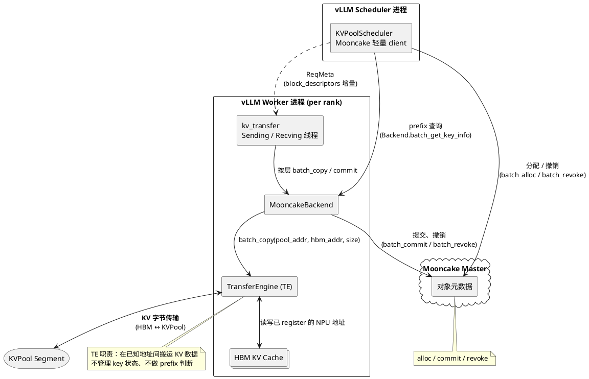
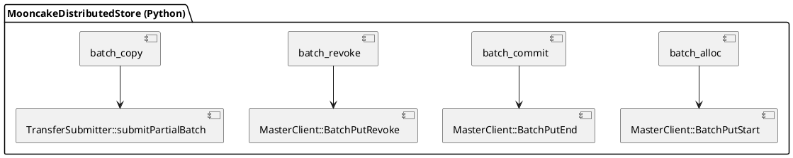
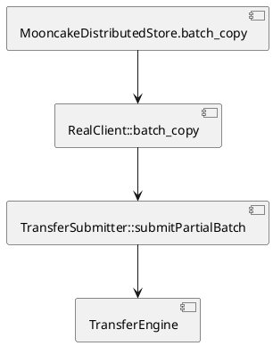
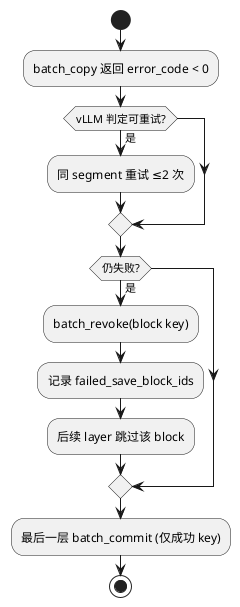
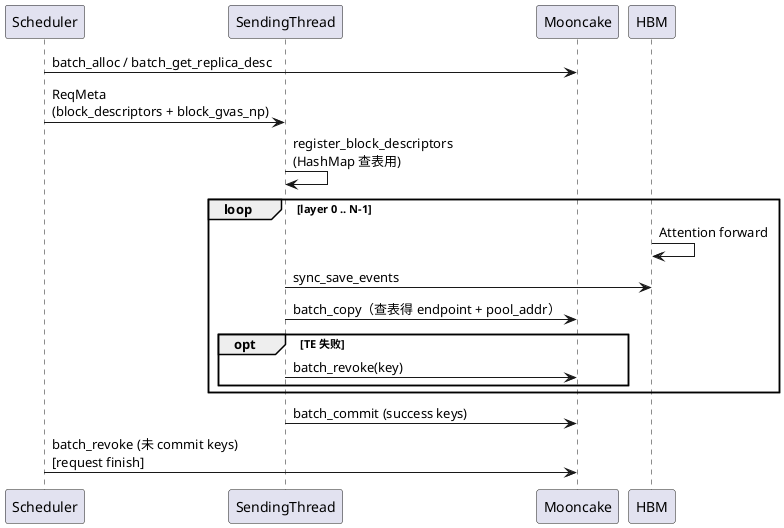
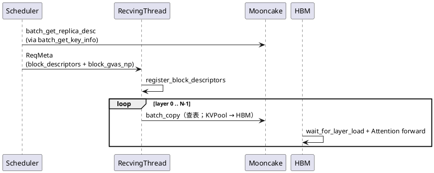

Source: features/kv-pool-layerwise-reuse/references/snapshots/design-mooncake-layerwise-gva-put.md
Captured At: 2026-07-09T19:21:19+08:00
Notes: User-provided preliminary design document for implementing layerwise KVPool put with Mooncake instead of memcache.

# Mooncake Layerwise KVPool Put 设计文档

## 1. 背景与目标

### 1.1 现状

[vLLM Issue #33398](https://github.com/vllm-project/vllm/issues/33398) 提出 layerwise KV cache onload/offload：推理按层推进，KV 在 HBM 与外接 KVPool 之间异步搬运，以降低 Prefill 阶段 HBM 占用并支撑 prefix cache。实现PR为[vLLM-Ascend PR #10733](https://github.com/vllm-project/vllm-ascend/pull/10733)。

该编排与 KVPool 后端解耦。**memcache** 已支持 layerwise 所需的分配、按址传输与提交语义。**Mooncake** 在 layerwise 场景尚缺对应的元数据与生命周期接口，无法直接复用该路径。

### 1.2 目标

为 Mooncake 补齐 layerwise 所需的 KVPool 对象生命周期与批量接口，使 vLLM-Ascend 在 `backend=mooncake` 时复用现有 layerwise 编排，仅扩展 backend 适配层。

### 1.3 非目标

- 不改变 vLLM attention 层 hook（`wait_for_layer_load` / `save_kv_layer`）契约。
- 不替代 `MooncakeLayerwiseConnector`（PD P2P 逐层推送）；本方案针对 **AscendStoreConnector + KVPool prefix cache**。
- 不要求 Mooncake 支持「按 layer 单独 revoke」；生命周期粒度为 **per-block key**。

### 1.4 设计原则

- **推理优先**：KVPool offload 不得阻塞 HBM forward 热路径。
- **Prefix 一致**：未完成写入的对象不参与 prefix hit。
- **接口批量**：Mooncake 新增能力尽量以 batch API 提供。
- **最大复用**：沿用现有 layerwise 编排，仅扩展 Mooncake backend。

---

## 2. 架构总览

### 2.1 组件职责

整体划分为 **元数据平面**与 **数据平面**：前者负责对象分配、状态管理与 prefix 查询；后者由 TE 完成 HBM 与 KVPool 之间的 KV 数据传输。



**各组件职责**

| 组件 | 职责 |
|------|------|
| Scheduler client | 推理前执行 block 级对象分配与 prefix 命中判定；请求结束时回收未提交对象 |
| Mooncake Master | 维护 Mooncake 全局存储对象生命周期状态；不参与 KV 数据传输 |
| kv_transfer | layerwise 传输编排：offset 计算、按层调度 save/load 任务 |
| MooncakeBackend | 封装 Mooncake 接口；Worker 侧维护 `(req_id, block_key) → descriptor` 供 TE 寻址 |
| TE | 在已注册 HBM 地址与 KVPool DRAM 地址之间执行 KV 数据搬运 |

### 2.2 与现有 put 路径的关系

| 模式 | API | 使用配置 |
|------|-----|----------|
| 传统整 key put | `put` / `get`（`batch_put_from_multi_buffers`） | `use_layerwise=false` |
| KeyLayer put | 每层独立 key 的 `put`/`get` | `use_layerwise=true`，当前 Mooncake layerwise fallback |
| **逐层 batch_copy put（本方案）** | `batch_alloc` + `batch_copy` + `batch_commit` | `use_layerwise=true` + Mooncake 支持 alloc / commit |

三套路径可并存；vLLM 代码中由 `use_gva_layerwise` 在 **逐层 batch_copy 路径** 与 KeyLayer 之间切换（开关命名来自 memcache 侧 GVA 路径实现）。

### 2.3 Block key 对象模型

§2.1 元数据平面管理的对象即 **block key**：与 memcache `use_gva_layerwise` 相同，每个 vLLM logical block 对应一个 key（`{model_name}@{block_hash.hex()}`；尾块为 `{model_name}@{req_id}_lastblock`），非每层独立 key。

Scheduler 通过 `Backend.batch_get_key_info` / `batch_alloc` / `batch_revoke` 管理其生命周期；Worker 通过 `batch_copy` / `batch_commit` 写入 KV 数据。Mooncake 上游改动见 §3；vLLM 适配见 §4。prefix 查询复用 Mooncake 现网 `batch_get_replica_desc`，由 vLLM `MooncakeBackend` 适配（§4.3）。核心约束为 commit 前 prefix 必须 miss：

| 阶段 | `batch_get_key_info` | prefix hit | Worker 写入 |
|------|---------------------|------------|------------|
| 未 commit（未 alloc 或 PutStart 中） | size=0，与 key 不存在相同 | miss | alloc 后 `batch_copy` |
| 已 commit | size=alloc_size | hit | 只读 load |

---

## 3. Mooncake 改动

本节描述 **mooncake-wheel 上游**需新增与扩展的全部能力（API 签名、Master/TE 实现、错误语义）。

### 3.1 改动总览与分层



| 模块 | 改动 |
|------|------|
| `mooncake-wheel` | 暴露 `batch_alloc` / `batch_copy` / `batch_commit` / `batch_revoke` |
| `MasterClient` | `BatchPutStart` / `BatchPutEnd` / `BatchPutRevoke`；RPC 可选 `authorized_client_id` |
| `TransferSubmitter` | 新增 `submitPartialBatch`（部分写，不经 `validateTransferParams`） |
| Mooncake Master | `PutEnd` / `PutRevoke` 跨 Client 身份校验；PROCESSING 对象不驱逐 |

对象生命周期：**PutStart（alloc）→ 多次 TE 部分写（copy）→ PutEnd（commit）**；失败或放弃走 **PutRevoke（revoke）**。

### 3.2 公共类型

layerwise 的 offload / load 均由 `LayerBatchBuilder` 计算 `pool_addr` 与 `hbm_addr`，通过同一 `batch_copy` 按方向搬运，不再走整 key 的 `put` / `get`。

```python
class CopyDirection(IntEnum):
    TO_POOL = 0    # HBM → KVPool（put / offload）
    FROM_POOL = 1  # KVPool → HBM（get / onload）
```

与 memcache `MmcDirect` 对齐。

与 memcache `MmcDirect` 对齐。

```python
@dataclass
class Descriptor:
    te_endpoint: str   # TE openSegment
    addr: int          # memory replica buffer_address_
    size: int          # alloc / replica 总字节数

@dataclass
class AllocResult:
    descriptor: Descriptor
    error_code: int    # 0 成功；<0 为 Mooncake ErrorCode
```

### 3.3 `batch_alloc`

#### API 签名

```python
def batch_alloc(
    self,
    keys: list[str],
    sizes: list[int],
    config: ReplicateConfig | None = None,
) -> list[AllocResult]:
    """
    为每个 key 在 KVPool segment 上预留一块连续内存（PutStart），不触发数据传输。
    """
```

成功时 `descriptor` 供后续 `batch_copy` 与跨进程下发；`block_gvas_np` 取 `descriptor.addr`（同 memcache GVA）。失败时 `descriptor` 为零值。

#### 实现

1. `mooncake-wheel` 新增 `MooncakeDistributedStore.batch_alloc`；内部调用 `MasterClient::BatchPutStart`（per-key `PutStart`）。
2. `PutStart` 成功：从 **首个 memory replica** 的 `AllocatedBuffer::Descriptor` 填入 `AllocResult.descriptor`，`error_code = 0`；对象进入 **PROCESSING**（`metadata.client_id` 记录 PutStart 发起方）。
3. 批量 RPC **per-key 独立返回**：单个 key 失败不影响同批其他 key。**不触发 TE、不调用 PutEnd**。

#### 返回值语义

**按 metadata 状态**（`PutStart` 入口的 key 冲突检测）：

| metadata 中 key状态 | `PutStart` 行为 | `descriptor` | `error_code` |
|---------------|----------------|--------------|--------------|
| 不存在 | 分配 segment 内存，写入 metadata（PROCESSING） | 有效（`addr > 0`） | `0` |
| PROCESSING，未超时 | 拒绝 | 零值 | `OBJECT_ALREADY_EXISTS`（-705） |
| PROCESSING，已超时且无 COMPLETE replica | 丢弃旧 metadata 后重新分配 | 有效 | `0` |
| COMPLETE（已 PutEnd） | 拒绝 | 零值 | `OBJECT_ALREADY_EXISTS`（-705） |

**其他失败**（分配请求本身失败，与 key 是否已存在无关）：

| 条件 | `descriptor` | `error_code` |
|------|--------------|--------------|
| segment 空间不足 | 零值 | `NO_AVAILABLE_HANDLE`（-200） |
| 参数非法 | 零值 | `INVALID_PARAMS`（-600） |
| RPC / 网络异常 | 零值 | `RPC_FAIL`（-900） |

PROCESSING 阶段对象不参与 prefix 查询（`BatchGetReplicaList` 仅返回 COMPLETE replica）。

### 3.4 `batch_copy`

layerwise 每层只写 alloc 块中的一小段，须走独立数据面路径 `submitPartialBatch`（**不**经现网 `put` / `validateTransferParams`）。

#### API 签名（Mooncake store 层）

```python
def batch_copy(
    self,
    descriptors: list[Descriptor],
    pool_addrs: list[int],
    hbm_addrs: list[int],
    sizes: list[int],
    direction: int,
) -> list[int]:
    """
    在已 register 的 HBM 与 KVPool memory segment 之间批量部分拷贝。
    四个列表等长；不触发 PutStart/PutEnd，不访问 Master RPC。
    返回与入参等长的 error_code 列表：0 成功，<0 为 Mooncake ErrorCode。
    """
```

`direction` 同 §3.2 `CopyDirection` / memcache `MmcDirect`。

**调用方**：Worker 进程（`contribute_memory=True`）的 `kv_transfer` 传输线程；Scheduler 不调用。

#### C++ 分层



| 层级 | 职责 |
|------|------|
| `TransferSubmitter::submitPartialBatch` | 段内边界校验；其余复用 `submitTransferEngineOperation` + `submitTransfer` + `TransferFuture::get()`（`target_offset` 改为绝对 `pool_addr`） |
| `RealClient::batch_copy` | 入参校验；调用 `submitPartialBatch`；`ErrorCode` → Python `int`（同 `put_from`） |
| `mooncake-wheel` | Python 暴露与列表长度校验 |

新增`submitPartialBatch`，不改动 `submit` / `validateTransferParams`、现网 `batch_put_from`。

#### `submitPartialBatch` 要点

每条 copy `i`：

1. **校验**：`descriptors[i].addr ≤ pool_addrs[i]`，`pool_addrs[i] + sizes[i] ≤ descriptors[i].addr + descriptors[i].size`，`sizes[i] > 0`，`te_endpoint` 非空。
2. **TE 请求**：`openSegment(descriptors[i].te_endpoint)`；`target_offset = pool_addrs[i]`；`TO_POOL`→WRITE、`FROM_POOL`→READ。
3. **组批**：校验通过条目同一 `batch_id` 提交；单条失败单独填错码，不丢弃同批其余条目。
4. **同步返回**：对齐 memcache `batch_copy` 阻塞语义。

与现网 `put` 差异：put 要求 slice 总长 == alloc size；`batch_copy` 允许 `sizes[i] << descriptors[i].size`，且不访问 Master。

#### 错误与约束

返回与入参等长的 `list[int]`：`0` 表示该条 copy 成功，`<0` 为 Mooncake `ErrorCode`。

| 条件 | `error_code` |
|------|--------------|
| 传输成功 | `0`（`OK`） |
| 四个列表长度不一致 | `INVALID_PARAMS`（-600） |
| `sizes[i] == 0` | `INVALID_PARAMS`（-600） |
| `te_endpoint` 为空 | `INVALID_PARAMS`（-600） |
| 段内越界：`pool_addr + size` 超出 `descriptor.addr + descriptor.size` | `INVALID_PARAMS`（-600） |
| TE 传输失败（含 submit 失败、等待完成失败） | `TRANSFER_FAIL`（-800） |

### 3.5 `batch_commit`

#### API 签名

```python
def batch_commit(self, keys: list[str]) -> list[int]:
    """
    对已 PutStart、尚未 PutEnd 的 key 执行 PutEnd，确认写入完成。

    Returns:
        与 keys 等长的 error_code 列表，0 成功。
    """
```

#### 语义

将处于 **PROCESSING** 的对象确认为 **COMPLETE**。调用成功后 key 对 `batch_get_replica_desc` / `batch_is_exist` 可见。与 `batch_alloc`、`batch_copy` 组成「预留 → 写入 → 发布」；**不传输数据**。

#### 实现

1. **Python 封装**：`mooncake-wheel` 新增 `MooncakeDistributedStore.batch_commit(keys)`；校验 `keys` 非空后，将 `caller_client_id`（本 store `Client` 的 `client_id`）及可选 `authorized_client_id` 填入 RPC 请求，调用 `MasterClient::BatchPutEnd`（或逐 key `PutEnd`）；返回与 `keys` 等长的 `error_code` 列表。
2. **Master 处理**：对每个 key 查 metadata；校验 key 存在且 replica 处于 **PROCESSING**（已 PutStart、未 PutEnd）；校验 `caller_client_id == metadata.client_id`，或 `authorized_client_id == metadata.client_id`；通过后将该 key 的 memory replica 状态置为 **COMPLETE**，从 processing 集合移除，更新 LRU，使 `batch_get_replica_desc` / `batch_is_exist` 对该 key 返回命中。
3. **幂等与错误**：已 **COMPLETE** 的 key 再次 commit 返回 `0`；key 不存在返回 `OBJECT_NOT_FOUND`（-704）；`caller_client_id` 与 `authorized_client_id` 均不匹配 `metadata.client_id` 返回 `ILLEGAL_CLIENT`（-601）。**不传输数据、不调用 TE**。

#### 返回值语义

| metadata 状态 | `error_code` |
|---------------|--------------|
| PROCESSING，`PutEnd` 成功 | `0` |
| 已 COMPLETE | `0`（幂等） |
| 不存在 | `OBJECT_NOT_FOUND`（-704） |
| `caller_client_id` 与 `authorized_client_id` 均不匹配 | `ILLEGAL_CLIENT`（-601） |

### 3.6 `batch_revoke`

#### API 签名

```python
def batch_revoke(self, keys: list[str]) -> list[int]:
    """
    放弃已 alloc 未 commit 的对象（PutRevoke）。释放 KVPool 内存与 metadata。
    粒度：整个 key（整块 alloc），不按 layer revoke。
    """
```

#### 语义

- 仅对 **PROCESSING**（已 PutStart、未 PutEnd）对象有效；已 **COMPLETE** 的对象走淘汰/evict，不走 revoke。
- revoke 后 key 回到未分配，可再次 `batch_alloc`。

#### 实现

1. **Python 封装**：`mooncake-wheel` 新增 `MooncakeDistributedStore.batch_revoke(keys)`；填入 `caller_client_id` 及可选 `authorized_client_id`，调用 `MasterClient::BatchPutRevoke`；返回与 `keys` 等长的 `error_code` 列表。
2. **Master 处理**：对每个 key 查 metadata；校验 **PROCESSING**；校验 `caller_client_id == metadata.client_id` 或 `authorized_client_id == metadata.client_id`；通过后释放 segment 内存、清除 PutStart 记录、从 processing 集合移除，使 prefix 查询对该 key 返回 miss。
3. **错误**：key 不存在返回 `OBJECT_NOT_FOUND`（-704）；身份不匹配返回 `ILLEGAL_CLIENT`（-601）；已 **COMPLETE** 返回 `INVALID_PARAMS` 或等价错误码（非 revoke 目标状态）。

#### 返回值语义

| metadata 状态 | `error_code` |
|---------------|--------------|
| PROCESSING，`PutRevoke` 成功 | `0` |
| 不存在 | `OBJECT_NOT_FOUND`（-704） |
| 已 COMPLETE | 非零（不可 revoke） |
| `caller_client_id` 与 `authorized_client_id` 均不匹配 | `ILLEGAL_CLIENT`（-601） |

### 3.7 Master RPC：`authorized_client_id`

PutStart 与 PutEnd/PutRevoke 可能由不同 store `Client` 发起（各 `generate_uuid()`）。`batch_commit` / `batch_revoke` 的 Master RPC 请求携带：

| 字段 | 含义 |
|------|------|
| `caller_client_id` | 本次 RPC 发起方 store 的 `client_id` |
| `authorized_client_id`（可选） | PutStart 发起方的 `metadata.client_id` |

Master 校验：`caller_client_id == metadata.client_id`，或 `authorized_client_id == metadata.client_id` 则放行。该字段为 **RPC 内部字段**，`mooncake-wheel` 在 `batch_commit` / `batch_revoke` 封装内透传，**不单独暴露为 store 公共 API**。vLLM 侧如何传递见 §4.3。

### 3.8 与现有 `put` 的共存

- `put` 可实现为：`batch_alloc` → `batch_copy`（满写）→ `batch_commit` 的快捷路径。
- 逐层 `batch_copy` 路径 **禁止** 对同一 key 在未 commit 时再次 `put`。
- alloc 未 commit 期间 **不驱逐** PutStart 对象。

### 3.9 配置与环境

沿用现有 Mooncake Ascend 配置：

- `protocol: ascend`
- `metadata_server` / `master_server_address`
- `ASCEND_ENABLE_USE_FABRIC_MEM`（A3 fabric 内存方案）
- SSD offload 与 layerwise 是否并用由 **vLLM 配置**决定；Mooncake `batch_copy` 不做介质类型校验。

---

## 4. vLLM-Ascend 改动

本节描述 vLLM-Ascend 在 `backend=mooncake` + `use_layerwise` 下需改动的模块与调用约定。Mooncake 上游 API 定义见 §3。

### 4.1 Scheduler 与 Worker 客户端职责

Scheduler 进程与推理 Worker 进程各持一个 `MooncakeBackend` 实例：

| 能力 | Scheduler 进程 | Worker 进程 | 说明 |
|------|----------------|-------------|------|
| `contribute_memory` | `False` | `True` | |
| `global_segment_size` | 0 | 配置值 | |
| `batch_alloc` | ✅ | 否 | 委托 §3.3 |
| `batch_get_key_info` | ✅ | ✅ | Backend 适配 `batch_get_replica_desc`（§4.3） |
| `register_buffer` | 否 | ✅ | |
| `batch_copy` | 否 | ✅ | 委托 §3.4 |
| `batch_commit` | 否 | ✅ | 委托 §3.5 |
| `batch_revoke` | ✅ | ✅ | Scheduler 清未写完请求；Worker TE 失败时 revoke |

复用已有 `MooncakeBackend.create_scheduler_client(contribute_memory=False)`；Worker backend 挂接 §3 新 API。

### 4.2 开关与能力探测

**文件**：`ascend_store_connector.py`、`pool_worker.py`、`pool_scheduler.py`

```python
# 现状
use_gva_layerwise = use_layerwise and backend_name == "memcache"

# 目标（示例）
use_gva_layerwise = use_layerwise and backend_name in ("memcache", "mooncake")
# 或：backend_class.supports_gva_layerwise()
```

新增配置项（可选，默认 true）：

```json
{
  "kv_connector_extra_config": {
    "use_layerwise": true,
    "backend": "mooncake",
    "mooncake_layerwise_batch_copy": true
  }
}
```

### 4.3 `backend/backend.py` 与 `mooncake_backend.py`

memcache 侧 `batch_alloc` 已存在；Mooncake 委托 §3.3 `store.batch_alloc`。

#### Backend ABC 扩展

新增可选方法（默认 `NotImplementedError`）：

```python
def batch_copy(
    self,
    pool_addrs: list[int],
    hbm_addrs: list[int],
    sizes: list[int],
    direction: int,
) -> list[int] | int:
    raise NotImplementedError(...)

def batch_commit(self, keys: list[str]) -> list[int]:
    raise NotImplementedError(...)

def batch_revoke(self, keys: list[str]) -> list[int]:
    raise NotImplementedError(...)
```

#### `MooncakeBackend` 封装

| 方法 | 实现 |
|------|------|
| `batch_alloc` | 委托 `store.batch_alloc`；返回 `list[AllocResult]`（含 `descriptor`） |
| `batch_copy` | 查表得 `Descriptor`，组装 `descriptors` 后委托 `store.batch_copy` |
| `batch_commit` | 委托 `store.batch_commit`；跨 Client 时内部透传 `authorized_client_id`（§3.7） |
| `batch_revoke` | 委托 `store.batch_revoke`；同上 |
| `create_scheduler_client` | **已有**，保持不变 |

#### `batch_get_key_info`（Backend 适配，Mooncake 上游不新增）

`pool_scheduler` 调用点与 memcache 相同；**`MemcacheBackend` 不变**。**`MooncakeBackend` 新增实现**：

1. 调用 Mooncake 现网 `store.batch_get_replica_desc(keys)`（底层 `BatchGetReplicaList`）。
2. 按输入 `keys` 顺序构造与 memcache 兼容的 `KeyInfo`（`size()`、`gva_list()`）：
   - 含 **COMPLETE memory replica**：`size = descriptor.size`，`gva_list() = [descriptor.addr]`；
   - key 缺失、仅 PROCESSING、或仅有 disk replica：`size = 0`，`gva_list() = []`。
3. Scheduler 构造 `ReqMeta` 时：`block_gvas_np` = `descriptor.addr`；随 `block_key` 一并下发 `descriptor`（§4.7）。

`pool_scheduler._get_layerwise_gva_hit_tokens`、`_ensure_tracker_gvas_cover_blocks` **调用点不变**。

#### 跨进程 descriptor 与 PutStart 发起方传递

Mooncake 无法像 memcache 一样单靠 GVA 整数跨进程寻址；Scheduler 在 alloc / prefix 命中时取得 `Descriptor`，经 `ReqMeta` 增量下发 Worker。

| 场景 | 动作 |
|------|------|
| prefix 命中 | `batch_get_key_info` → `Descriptor` |
| 未命中 | `batch_alloc` → `AllocResult.descriptor` |
| 本请求已 alloc 未 commit | 复用 `RequestTracker` 中缓存 |

chunked prefill 等多轮调度：仅为**新增** block 查池/alloc，当帧 `ReqMeta` 增量附带 `(block_key, descriptor)`。

**PutStart 发起方 `client_id`（供 Worker 代 Scheduler 收尾）**：

1. Scheduler `batch_alloc` 时，PutStart 的 `metadata.client_id` 即 Scheduler store 实例的 `client_id`（`MooncakeDistributedStore.setup()` 时 `generate_uuid()`）。
2. Scheduler 在 `build_connector_meta` / `ReqMeta` 中附带 **`alloc_client_id`**（请求级常量，取 `store_scheduler.store` 的 `client_id`），与 `block_descriptors` 一并下发。
3. Worker `register_block_descriptors` 时缓存 `alloc_client_id`；`MooncakeBackend` 调 `batch_commit` / `batch_revoke` 时在 store 封装层内部传入 `authorized_client_id=alloc_client_id`（对外仍调用 `batch_commit(keys)`）。
4. Scheduler 自行 `batch_revoke`（请求终止）时不需 `authorized_client_id`（`caller_client_id` 即 PutStart 发起方）。

**Worker** 维护 `_replica_table: dict[tuple[str, str], Descriptor]`（`(req_id, block_key)`）；`batch_copy` 时按 `block_keys` 查表。请求结束 `clear_block_descriptors(req_id)`。

**职责划分**

| 角色 | alloc / 查 desc | 数据面 TE |
|------|-----------------|-----------|
| Scheduler client | ✅ `batch_alloc` / `batch_get_key_info` | ❌ |
| Worker backend | ❌（仅读 HashMap） | ✅ `batch_copy` / `batch_commit` / `batch_revoke` |

Scheduler client 实现 alloc、query、revoke；Worker 实现 copy、commit 及 descriptor 表生命周期。

#### 多 rank 下的 commit / revoke 发送方

8 卡 TP 等场景：各 rank 独立 `batch_copy` 写同一 alloc 块内各自切片；**每个 block key 的 `batch_commit` / TE 失败 `batch_revoke` 只发一次**。

| 操作 | vLLM 发送方 | 说明 |
|------|------------|------|
| `batch_commit` | **`tp_rank == 0`** 的 `KVCacheStoreLayerSendingThread` | 本请求最后一层、全部 rank `batch_copy` 成功后；commit 前 **CPU `dist.barrier()`** |
| `batch_revoke`（TE 失败） | **`tp_rank == 0`** | 避免 8 路重复 RPC；backend 内部带 `authorized_client_id` |
| `batch_revoke`（请求终止） | **Scheduler** | 自身 `client_id` 匹配 PutStart，无需 `authorized_client_id` |

`stored_requests` 为 per-rank 本地计数，不能代替跨 rank 同步；barrier 与 layerwise forward 按层同步配合使用。

### 4.4 `kv_transfer.py`

| 改动点 | 说明 |
|--------|------|
| `_batch_copy_with_limits` | Mooncake：`m_store.batch_copy(..., block_keys=...)`，由 backend 查 `(req_id, block_key)`；memcache 不变 |
| `KVCacheStoreLayerSendingThread._handle_request` | copy 失败：短重试 → **tp_rank==0** `batch_revoke` → 记录 `failed_save_block_ids` |
| 最后一层 save | **tp_rank==0**：`dist.barrier()` 后对本请求成功 block 调用 `batch_commit` |
| `LayerBatchBuilder` | 继续用 `block_gvas_np` 算 `pool_addr`；为 Mooncake 路径并行产出 `block_keys` 列表供 `batch_copy` 查表 |
| `failed_save_block_ids` | 新增于 SendingThread 或 `pool_worker` |

**load 路径**（`KVCacheStoreLayerRecvingThread`）：Mooncake 与 save 相同，经 `batch_copy` + descriptor 查表；memcache 逻辑不变。

### 4.5 `pool_scheduler.py`

#### `batch_alloc` 调用约定

**调用方**：Scheduler 轻量 client（`contribute_memory=False`）。

**调用位置**（与 memcache layerwise 相同）：

| 路径 | 方法 | 触发场景 |
|------|------|----------|
| Prefill 写 pool | `_generate_keys_and_alloc` | 请求新增 logical block，为新 key 分配 `base_addr` |
| Load 补分配 | `_ensure_tracker_gvas_cover_blocks` | `batch_get_key_info` 返回 size=0 的 key 批量补 alloc |

**key 粒度与 `alloc_size`**：每个 vLLM logical block 一个 key（`{model_name}@{block_hash.hex()}`；尾块为 `{model_name}@{req_id}_lastblock`）。`sizes[i]` 由 vLLM 计算，Mooncake 原样作为 `PutStart` 的 `slice_length`：

```
alloc_size = page_size_bytes × keys_per_block_hash
keys_per_block_hash = pcp_size × dcp_size × (tp_size // put_step) × num_layers
```

与 `pool_scheduler.py` / `pool_worker.py` 现网 memcache 路径一致：`LayerBatchBuilder` 在 `buffer_address`（`block_gvas`）上叠加 layer / rank 偏移后调用 `batch_copy`；Mooncake 另由 `block_key` 查 `transport_endpoint`。

#### per-block 地址解析（`_ensure_tracker_gvas_cover_blocks`）

粒度为 **单个 logical block**。每次请求**扩 block**（含 chunked prefill 后续调度步）时，对新增 key 按序判定并批量 alloc；结果写入 `RequestTracker` 并 **增量** 进入当帧 `ReqMeta.block_descriptors`（`(block_key, descriptor)`）：

| 步骤 | 数据源 | 条件 | 结果 |
|------|--------|------|------|
| 1 | `batch_get_key_info` | `size > 0` | 使用 replica 的 `buffer_address` + `transport_endpoint`（prefix 命中） |
| 2 | `RequestTracker`（`block_keys` ↔ descriptor） | 本请求内该 key 已 alloc | 复用 tracker（PROCESSING，Query 仍为 `size=0`） |
| 3 | `batch_alloc` | 上述均未命中 | PutStart，写入 tracker 与 desc 三字段 |

尾块路径 `_generate_keys_and_alloc` 继续用 `last_block_gva` / `last_block_*` desc 做同类保护。

#### 其他改动

| 改动点 | 说明 |
|--------|------|
| `use_gva_layerwise` | 扩展至 mooncake |
| `_get_layerwise_gva_hit_tokens` | 依赖 `batch_get_key_info` 仅已 commit 返回 size>0 |
| 请求结束 / preempt | 对未 commit 的 `block_keys` 调用 `store_scheduler.batch_revoke` |
| `ReqMeta.alloc_client_id` | `build_connector_meta` 时写入 Scheduler store 的 `client_id`，供 Worker 代收尾 |

需在 `build_connector_meta` 或 request finish 路径中，对未 commit 对象执行 `batch_revoke`（与传输失败回收相互独立）。

### 4.6 `pool_worker.py`

| 改动点 | 说明 |
|--------|------|
| `use_gva_layerwise` | 扩展至 `backend=mooncake` |
| 传输线程 | Mooncake 使用 `KVCacheStoreLayerSendingThread` / `LayerRecvingThread`（与 memcache 相同） |
| 处理 `ReqMeta` | `register_block_descriptors(req_id, block_descriptors, alloc_client_id)` |
| `get_finished` | `MooncakeBackend.clear_block_descriptors(req_id)` |

**不变**：`process_layer_data`、`save_kv_layer` 异步语义、`LayerTransferTask` 结构；**memcache backend 无上述钩子**。

### 4.7 `config_data.py` / `RequestTracker`

- **memcache**：`block_gvas`、`block_keys` 语义与代码路径 **保持不变**。
- **Mooncake 新增**：
  - `Descriptor`（§3.2）、`ReqMeta` 增量 `(block_key, descriptor)` 列表；
  - `ReqMeta.alloc_client_id`（Scheduler PutStart 发起方 `client_id`）；
  - `RequestTracker` 缓存 `dict[block_key, Descriptor]`。
- 可选：`pending_commit_keys: set[str]`，供 finish 时 `batch_revoke`。

### 4.8 文档与配置示例

更新：

- `RFC-33398-layerwise-kv-implementation.md` §3.5 backend 表
- `docs/.../layerwise_kv_pool.md`：`backend: mooncake` 的逐层 batch_copy 配置说明

示例：

```json
{
  "kv_connector": "AscendStoreConnector",
  "kv_role": "kv_both",
  "kv_connector_extra_config": {
    "use_layerwise": true,
    "backend": "mooncake",
    "mooncake_layerwise_batch_copy": true,
    "layerwise_num_shared_buffers": 6,
    "layerwise_prefetch_layers": 2
  }
}
```

### 4.9 测试

| 类型 | 路径 | 内容 |
|------|------|------|
| UT | `tests/ut/distributed/ascend_store/test_mooncake_layerwise_put_backend.py` | mock store：alloc→copy→commit 状态机 |
| UT | `tests/ut/distributed/ascend_store/test_layerwise_save_failure.py` | TE 失败 → revoke → 后续层 skip |
| UT | `tests/ut/distributed/ascend_store/test_kv_transfer_gva.py` | `batch_copy` 走 Backend 抽象 |
| E2E | NPU + Mooncake 集群 | 与 memcache layerwise 用例对齐的 accuracy / prefix hit |

---

## 5. 错误处理与重试策略

### 5.1 策略总表

| 场景 | 重试 | revoke 粒度 | 推理 |
|------|------|-------------|------|
| TE `batch_copy` 瞬时失败（vLLM 按 `error_code` 判定，如 `TIMEOUT`） | 同 layer、同 segment，**1~2 次**短重试 | 单 block key | 继续 |
| TE 持续失败 / 致命错误（如 `INVALID_PARAMS`、`NOT_REGISTERED`） | 否 | 单 block key | 继续 |
| 请求 abort / 正常结束未 commit | 否 | 请求内所有未 commit 的 key | 继续或结束 |
| Worker 崩溃 | 否 | Mooncake 超时清理 | 重启 |
| Scheduler 预分配未写完 | 否 | 请求结束时 batch_revoke | 继续 |

### 5.2 vLLM Worker 侧 save 失败流程



### 5.3 load 路径

load 失败沿用现有 `_invalid_block_ids` + `record_failed_blocks`；不触发 revoke（已 commit 的对象只读）。若读到一半失败，由 vLLM 标记 block 无效并 fallback 重算。

---

## 6. 端到端时序

### 6.1 单层 Forward 与 KVPool / PD 传输

与 PR #10733 中 layerwise 实现一致：每层 attention 前后通过 connector hook 触发 KVPool 载入/写出；`save_kv_layer` 异步入队，不阻塞下一层 forward。PD 分离场景下，`AscendMultiConnector` 同时使用 `MooncakeLayerwiseConnector`（P→D 逐层推送）与 `AscendStoreConnector`（KVPool save）时，SendingThread 在写出 KVPool 前等待 `layer_transfer_finished_events`，避免 PD 传输未完成即覆写 HBM buffer。

```plantuml
@startuml
skinparam shadowing false

|Scheduler|
start
:build_connector_meta;
:batch_get_key_info / batch_alloc;
note right
  descriptor 写入 RequestTracker
  增量填入 ReqMeta.block_descriptors
  block_gvas_np 同步 base_addr
end note

|Worker 主线程|
:register_block_descriptors\n(ReqMeta → HashMap);

repeat :layer_id = 0 .. N-1

  |Worker 主线程|
  :wait_for_layer_load;
  note right
    RecvingThread 异步执行
    batch_copy（KVPool → HBM）
  end note

  :Attention forward（HBM）;

  :save_kv_layer;
  note right
    投递 SendingThread 后
    current_layer += 1
  end note

  |SendingThread|
  :sync_save_events;
  opt PD 场景（AscendMultiConnector）
    :等待 layer_transfer_finished_events;
    note right
      MooncakeLayerwiseConnector
      P 节点向 D 节点逐层推送完成
    end note
  end
  :batch_copy（HBM → KVPool）;
  opt TE 失败
    :短重试后 batch_revoke;
  end

repeat while (还有下一层?)

|SendingThread|
:batch_commit（成功 key）;

|Scheduler|
:request finish 时 batch_revoke\n（未 commit key）;
stop
@enduml
```

### 6.2 Save 时序（Producer / kv_both）



### 6.3 Load 时序（Consumer / prefix hit）



---

## 7. 验收标准

### 7.1 Mooncake

- [ ] 四个 batch API（`batch_alloc` / `batch_copy` / `batch_commit` / `batch_revoke`）在 Ascend protocol 下可用。
- [ ] `batch_copy` 返回 per-entry `error_code` 列表（0 成功，<0 失败）。
- [ ] `batch_commit` 后 `batch_is_exist` 为 hit。
- [ ] `batch_revoke` 后内存可复用，同 key 可再次 alloc。
- [ ] alloc 未 commit 期间不驱逐（与现 PutStart 一致）。

### 7.2 vLLM-Ascend

- [ ] `MooncakeBackend.batch_get_key_info`：已 commit 返回 `size > 0` + `base_addr`；PROCESSING / 不存在返回 `size = 0`。
- [ ] `use_layerwise=true` + `backend=mooncake` 走逐层 batch_copy 线程（非 KeyLayer）。
- [ ] Worker `register_block_descriptors` / `clear_block_descriptors`：请求结束无 descriptor 泄漏；`(req_id, block_key)` 查表可发起 TE。
- [ ] chunked prefill 多轮调度：新 block 增量写入 ReqMeta 与 HashMap 后可正常 save。
- [ ] TE 失败后该 block 不写 KVPool，其他 block 可 commit。
- [ ] 请求终止后无未 commit 对象残留。
- [ ] PD 场景 `layer_transfer_finished_events` 同步仍有效（`MooncakeLayerwiseConnector` + `AscendStoreConnector` 并存）。

---

## 8. 风险与开放问题

| 项 | 说明 | 状态 |
|----|------|------|
| TE 寻址 | endpoint + buffer 偏移 | **已定案**：§4.3 ReqMeta descriptor + Worker 查表 |
| 部分写 / 数据面 API | layerwise 单次 copy < alloc size | **已定案**：§3.4 `submitPartialBatch`；选型见 §10 |
| SSD + layerwise | layerwise 仅用 memory replica | **vLLM 侧**约束；Mooncake `batch_copy` 不强制拒绝 |
| fabric mem vs RPC TE | endpoint 格式差异 | 分别验证 |
| PutStart / PutEnd 跨 Client | Master RPC `authorized_client_id` | §3.7 |
| 多 rank 重复 commit / revoke | **tp_rank==0** 统一发送；commit 前 CPU barrier | §4.3 |
| hybrid KV groups | 现网 `NotImplementedError` | 本方案不阻塞 |

---

## 9. 参考代码索引

| 模块 | 路径 |
|------|------|
| memcache layerwise 参考实现 | `backend/memcache_backend.py` |
| Mooncake 现有 backend | `backend/mooncake_backend.py` |
| Scheduler alloc | `pool_scheduler.py`：` _generate_keys_and_alloc`, `_ensure_tracker_gvas_cover_blocks` |
| Offset 计算 | `kv_transfer.py`：`LayerBatchBuilder` |
| Save 线程 | `kv_transfer.py`：`KVCacheStoreLayerSendingThread` |
| Backend ABC | `backend/backend.py` |
| 分支实现说明 | `RFC-33398-layerwise-kv-implementation.md` |

---

## 10. 备选方案与选型

layerwise 需在 **PutStart 后、PutEnd 前** 对同一 alloc 块做多次小段 TE 写入；现网 `put` 的 `validateTransferParams` 要求单次写满整块，无法直接复用。

### 11.1 数据面备选

| 方案 | 做法 | 结论 |
|------|------|------|
| A. 放宽 `validateTransferParams` | put 路径允许部分写 | **不采用**——破坏整 key put 语义 |
| B. store 新增 `batch_copy` | `submitPartialBatch`，不经 put/Master | **采用**（§3.4） |
| C. vLLM 直连 `global_te` | Worker 自行 `openSegment` + `submitTransfer` | **不采用**——见下 |

### 11.2 为何选 B 而非 C

B 与 C 底层均为同一 `TransferEngine`（`submitTransfer` → ADXL/HIXL），性能无本质差别。选 B 主要因：

- **与 memcache 对称**：`kv_transfer` 统一走 `Backend.batch_copy`，Mooncake 仅多 descriptor 查表。
- **职责清晰**：段内越界、错误码映射、openSegment 缓存、metrics 集中在 store；重试策略在 vLLM（§5.1）。
- **场景不同**：PD `global_te` 是节点间 P2P；KVPool 是 segment + alloc 生命周期，宜与 `batch_alloc`/`batch_commit` 同属 store 域。
- **上游可复用**：能力落在 `mooncake-wheel`，非 vLLM 私有封装。

控制面（`batch_alloc` / `batch_commit` / `batch_revoke`）两方案相同；差异仅在数据面入口。

---

## 11. 版本记录

| 版本 | 日期 | 作者 | 说明 |
|------|------|------|------|
| 0.1 | 2026-07-05 | — | 初始稿：Mooncake 逐层 batch_copy KVPool put API 与 vLLM 适配 |
| 0.2 | 2026-07-06 | — | 定案 descriptor 传递与 store `submitPartialBatch`；选型见 §10 |
| 0.3 | 2026-07-06 | — | 统一 `Descriptor` 命名；去掉独立描述符章节 |
| 0.4 | 2026-07-07 | — | Master RPC `authorized_client_id`；vLLM `alloc_client_id` 传递与多 rank 发送方见 §4.3 |
| 0.5 | 2026-07-07 | — | 重组文档：§3 Mooncake 改动、§4 vLLM-Ascend 改动；删除原 §5 重复章节 |


