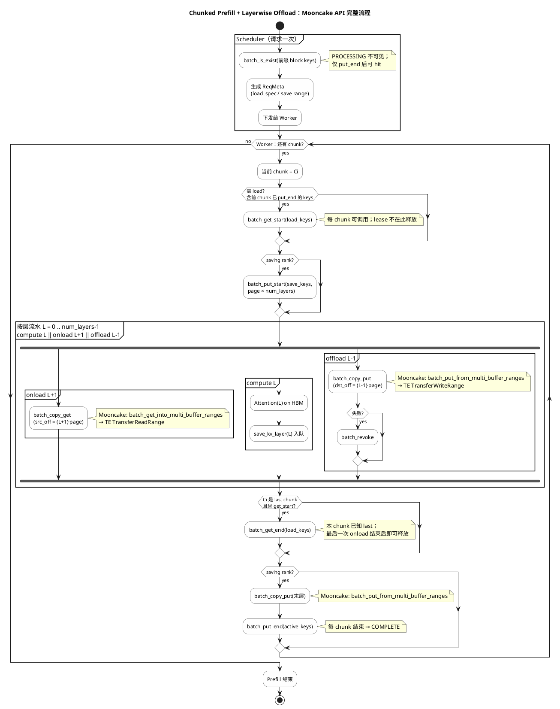

Source: https://hackmd.io/@QQ5HFJZeT1-uFJm16Qaq_Q/rJUTYuX4Ml
Captured At: 2026-07-20T12:06:39+08:00
Notes: Authoritative companion sequence diagram for chunked prefill with Mooncake layerwise session and ranged-transfer APIs.

# Chunked Prefill + Layerwise：Mooncake API 完整流程

场景：`use_layerwise=true` + `backend=mooncake`。

