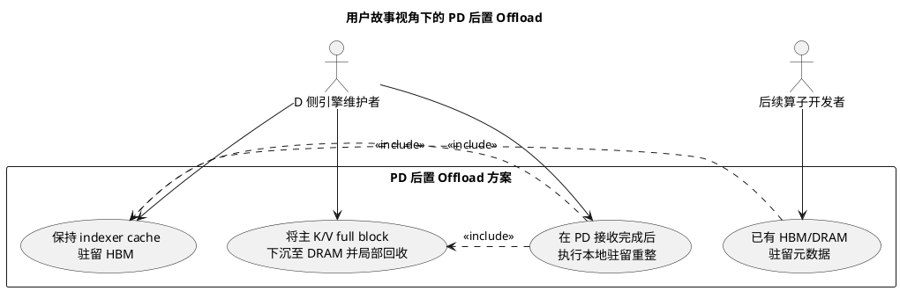
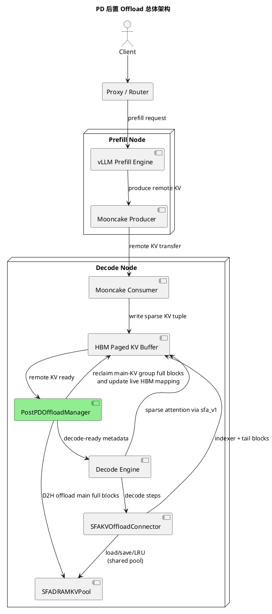
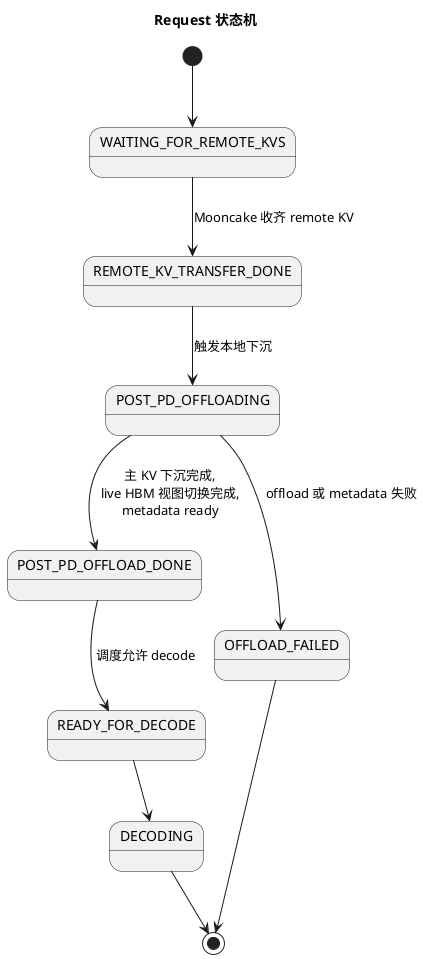
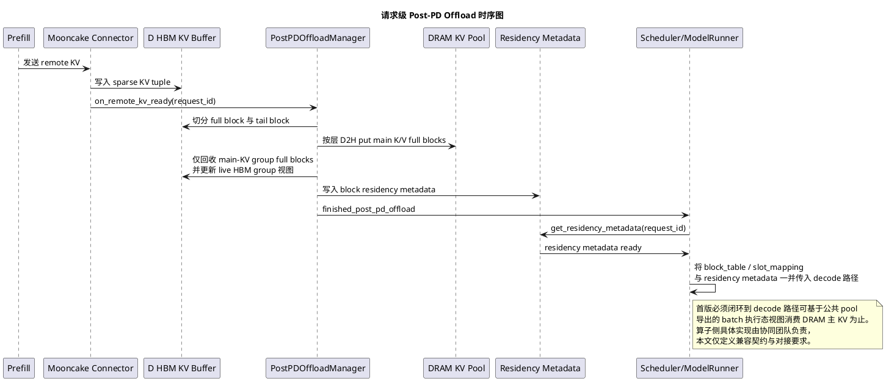

Source: https://hackmd.io/@QQ5HFJZeT1-uFJm16Qaq_Q/BJfYEWfXMg
Captured At: 2026-07-02T17:47:19+08:00
Notes: Markdown snapshot exported from HackMD /download endpoint.

# PD 后置 Offload 与 Indexer Cache 驻留设计方案

## 1. 摘要

本文提出一套面向 **GLM 5.1 当前 sparse MLA / SFA 实现路径** 的 PD 后置缓存重整方案。在保持现有 `P -> D` Mooncake 传输逻辑不变的前提下，于 Decode 节点新增一个 **Post-PD Adaptation Stage**：D 侧在收到完整 remote KV 后，将主 K/V full block 下沉到 SFA-compatible DRAM KV pool；indexer cache 与 tail block 保持 HBM 驻留，并在下沉完成后回收主 KV group 对应的 HBM full blocks。

该方案的目标是在 **不修改 P 侧生成逻辑、不修改 Mooncake 传输协议、不修改 remote KV 组织方式** 的前提下，降低 Decode 侧 HBM 占用，并建立稳定的 HBM/DRAM 驻留视图。

## 2. 动机

当前 GLM 5.1 在 PD 分离场景中，Prefill 节点通过 Mooncake 将 remote KV 直接传输到 Decode 节点的 HBM paged KV buffer。该路径可以高效完成远端 KV 接入，但对于后续 sparse attention / DSA 优化路径存在三个实际问题：

1. **HBM 占用过高**  
   Decode 节点在 remote KV 接入完成后，若仍要求当前 GLM 5.1 路线中的主 K/V (`ori kv_cache`) 全量驻留 HBM，则长上下文、多并发或大规模 PD 场景下 HBM 峰值较高。

2. **indexer 热数据与主 KV 冷数据的访问模式不同**  
   对于 GLM 5.1 当前 sparse MLA / SFA 路线，indexer 路径数据是后续 sparse top-k / indexer 计算的热数据，应持续常驻 HBM；而主 K/V 更适合按 full block 下沉到 DRAM，由后续 decode 路径按需加载。

3. **现有 Mooncake 传输与 SFA offload 流程之间缺少 D 侧 request-complete 重整阶段**  
   - `MooncakeConnectorV1` / `MooncakeLayerwiseConnector` 负责 remote KV 传输，不负责 D 侧本地冷热分层。
   - `SFAKVOffloadConnector` 当前的 store/load 逻辑运行在模型执行期，按层 dispatch、按 full block store 主 K/V。
   - 因此，PD decode 场景仍缺少一个专门的 D 侧本地编排层，把 Mooncake 已收齐的 remote KV 重组成“indexer 驻留 HBM、主 KV 落到 SFA-compatible DRAM KV pool”的驻留视图。

因此，需要在 D 侧补充一个面向 PD 场景的 **Post-PD offload 阶段**：在 remote KV 接收完成后，对主 KV cache 执行本地下沉与驻留重整，释放 Decode 侧 HBM 空间，并为后续 decode 阶段提供稳定的缓存驻留视图。

## 3. 目标与非目标

### 3.1 目标

1. 在不改变现有 Mooncake P->D 传输协议的前提下，为 D 侧增加 post-PD 本地下沉能力。
2. 保持 indexer 路径热数据位于 HBM，并沿用现有 indexer group 管理关系。
3. 将 GLM 5.1 当前 sparse MLA / SFA 路线中的主 K/V full block 从 HBM 下沉到 SFA-compatible DRAM KV pool，并在完成后回收主 KV group 对应的 HBM full blocks。
4. 明确 decode 侧 remote KV 接收完成、post-PD offload 完成、decode-ready 三者之间的状态边界，并给出与现有代码的改动落点。

### 3.2 非目标

1. 不修改 Prefill 侧 KV 生成逻辑。
2. 不修改 Mooncake TE 传输协议与 PD传输 的 remote KV 的组织方式，包括 block 编号、block 切分、block 内布局以及 sparse KV tuple 的跨节点传输形态；本文不改变这些内容，只在 D 侧接收完成后做本地重整。
3. 不在本方案内定义 decode 阶段 token 粒度 load/get 的具体算子实现；该类能力继续由现有 `SFAKVOffloadConnector` / `sfa_v1.py` 路径承担，本文只补齐其前置的 Post-PD bulk 下沉与 pool 映射。
4. 不重新设计 sparse KV tuple 的物理格式；本文只在 D 侧接收完成后对当前请求的 block 驻留位置做重整。
5. 本文只聚焦 **GLM 5.1 当前 sparse MLA / SFA 实现路径** 在 PD 场景下的 D 侧 post-PD 驻留重整，不直接扩展到其他模型或 `AscendDSABackend` 的通用方案。

## 4. 总体方案

### 4.1 核心思路

在 D 侧新增一个 **Post-PD Adaptation Stage**：

1. `P -> D` 传输保持现状；
2. D 侧等待 remote KV 完整接收；
3. 在 request 进入 decode 之前，执行本地重整：
   - indexer cache 保持 HBM 驻留；
   - 主 K/V full block 下沉到 **SFA-compatible DRAM KV pool**；
   - 主 K/V full block 下沉完成后，回收主 KV group 对应的 HBM full blocks；
   - partial tail block 继续保留在 HBM 中；
4. 将请求 ready 的定义从“PD 网络传输完成”升级为“PD 接收完成 + 本地下沉完成”；此后 decode 仍走现有 `SFAKVOffloadConnector` 与公共 pool 的运行期交互。

### 4.2 适配范围

本文仅讨论：**面向 GLM 5.1 类模型当前 sparse MLA / SFA 路线的请求级 / full-block 级 post-PD offload**。该方案统一兼容 `MooncakeConnectorV1` 与 `MooncakeLayerwiseConnector` 的 request-complete 语义；per-layer 渐进式 offload 不纳入本文范围。

## 5. 用户故事

- 作为 D 侧推理引擎维护者，我希望在 PD 接收完成后，自动将 **GLM 5.1 当前主 K/V full block** 下沉到 DRAM，并回收主 KV group 对应的 HBM full blocks，以降低 Decode 节点的 HBM 压力。
- 作为后续算子开发者，我希望在进入 Decode 前，D 侧已经形成稳定的驻留视图：**HBM 中存放 indexer 视图与 tail block，DRAM 中存放 SFA-compatible 主 K/V full block**，并暴露对应的驻留元数据，便于后续实现按需 H2D 加载和 token 粒度 get/load。



## 6. 风险与缓解措施

1. **风险：remote KV 已接收完成，但 post-PD offload 尚未完成时被提前调度进入 Decode。**  
   **缓解**：增加独立状态 `POST_PD_OFFLOAD_DONE`，只有该状态达成后才允许 request 进入 decode-ready。

2. **风险：主 KV group 回收后，request 的 HBM/DRAM block 映射与后续算子消费视图不一致。**
   **缓解**：定义统一的驻留元数据接口，并在回收主 KV group 时同步更新 request 的 live HBM 视图，明确逻辑 block 到 HBM/DRAM 物理位置的映射关系、block 状态、有效 token 范围及 partial tail block 的处理规则。

3. **风险：Post-PD offload 额外引入一次从 HBM 到 DRAM 的数据搬运，可能增加请求在进入 Decode 前的准备时间，从而影响 TTFT。**  
   **缓解**：首版优先保证语义正确与最小改动；后续再通过 pinned DRAM、layerwise copy 与 copy batching 等手段降低该阶段开销。

4. **风险：不同 Connector 的完成事件定义不一致。**  
   **缓解**：在 connector 抽象层统一引入 `REMOTE_KV_TRANSFER_DONE` -> `POST_PD_OFFLOAD_DONE` 的阶段划分，而非依赖某个 connector 的专有事件。

5. **风险：主 K/V D2H 尚未完成或 live HBM 视图尚未更新，就过早发布 metadata。**  
   **缓解**：对主 K/V full block 显式维护 `WRITING/READY/RECLAIM_PENDING/RECLAIMED` 状态。`POST_PD_OFFLOAD_DONE` 只依赖 D2H 完成、live HBM 视图切换完成和 residency metadata 已提交；物理 block 回收到 free list 可以异步完成。

## 7. 设计细节

本章按“**现有实现基线 -> 需要改动的存量代码与新增结构 -> 运行时契约与边界**”组织。重点描述：

1. 当前 PD 分离与 GLM 5.1 sparse MLA / SFA 路径已经如何工作；
2. 为实现 decode 侧 post-PD offload，需要在哪些现有路径上插入或改造；
3. 本方案与后续 decode 算子能力之间的实现边界是什么。

### 7.1 现有实现基线

当前实现中，与本方案直接相关的关键基线如下：

1. **GLM 5.1 当前实现路径是 sparse MLA / SFA 路线**  
   在当前仓中，`use_mla=True` 且 `use_sparse=True` 时，注意力后端选择 `AscendSFABackend`，而不是 `AscendDSABackend`。因此，本文方案不再围绕通用 DSA 6-tuple 展开，而是围绕 GLM 5.1 当前实际走到的 SFA 路径设计。

2. **PD 传输阶段由 Mooncake TE 负责，decode offload 由 SFA 负责**  
   `MooncakeConnectorV1` / `MooncakeLayerwiseConnector` 仅负责把 `P -> D` 的 remote KV 写入 decode 侧本地 HBM paged KV buffer。`SFAKVOffloadConnector`（需 `use_offload=true`）负责 decode 阶段与 DRAM pool 的运行期交互。当前缺口是：`finished_recving` 到达后直接把 remote KV 视为 decode-ready，缺少“收齐后 bulk 下沉到 pool、回收主 KV HBM full blocks”的 Post-PD 阶段。

3. **`SFAKVOffloadConnector` 当前已经定义了 GLM 5.1 Decode Sparse 阶段 CPU KV pool 形态**  
   现有 `SFAKVOffloadConnector` / `SFAKVOffloadWorker` 会在模型执行期按层 save 主 K/V full block 到 CPU pool，并在后续 sparse decode 时按 token 粒度 load/get。它当前的核心事实是：
   - store 的数据单位是 **full block**，tail block 不下沉；
   - 调度方式是 **layerwise dispatch**；
   - CPU pool 存的是 **主 K/V (`original kv_cache`)**，不是 indexer cache；
   - `request.block_ids` 存在主 KV 组与 indexer 组的区分，当前 `SFAKVOffloadConnector` 只对主 KV 组做 CPU offload。

4. **`SFAKVOffloadConnector` 当前定义了主 KV 的运行期 offload 形态**  
   它的 `save_kv_layer()` / `prepare_lru_resident_and_load()` 都在模型执行热路径内被调用，适合作为主 KV DRAM 形态与后续 load/get 语义的兼容基线。

5. **当前仓里 indexer group 复用现有多 group block 管理体系**  
   现有 `request.block_ids[0]` 已代表 indexer 组，其底层由通用的多 `kv_cache_group` block 管理体系承载。本文沿用这套 `request -> indexer group blocks` 关系。

6. **当前仓里已经有后续 decode 会消费的 batch 侧 metadata 通路**  
   `AscendCommonAttentionMetadata` 已预留 `indexer_block_table_tensor`、`indexer_slot_mapping`、`num_offloaded_blocks`、`req_ids_tensor` 等字段；`model_runner_v1.py` 和 `sfa_v1.py` 已能注入/消费这些字段。本文应复用这套注入通路，而不是再设计第二套 batch metadata 协议。

下图展示本方案相对于现有实现的插入位置：Mooncake 仍只负责 remote KV 传输；新增的 `PostPDOffloadManager` 负责 Post-PD bulk 下沉与驻留重整；decode 阶段继续由 `SFAKVOffloadConnector` 消费同一 `SFADRAMKVPool`。



### 7.2 总体改动面

本方案在现有实现上的改动面集中在以下五处：

1. **PD 接收完成回调**  
   在 `MooncakeConnectorV1` / `MooncakeLayerwiseConnector` 的 request-complete 路径上增加 `on_remote_kv_ready` 调用，使 decode 侧在 remote KV 收齐后进入本地下沉阶段。

2. **decode 侧新增本地 manager**  
   新增 `PostPDOffloadManager`，负责 GLM 5.1 当前主 K/V 的 **SFA-compatible DRAM KV pool** 管理、主 KV group 的局部 HBM full block 回收适配，以及 request 级驻留元数据维护。

3. **Decode 准入门禁**  
   在现有 scheduler 的 `WAITING_FOR_REMOTE_KVS` 放行路径上增加第二阶段完成态判定，确保 request 仅在 `POST_PD_OFFLOAD_DONE` 后进入 decode-ready。

4. **SFA decode 路径与公共 pool 衔接**  
   `SFAKVOffloadConnector` / `SFAKVOffloadScheduler` 继续承担 decode 运行期 offload；Post-PD 完成后须从 `SFADRAMKVPool` 引导已有 `cpu_block_ids`，避免首步 decode 重复分配或重复 D2H。

5. **后续算子共享元数据**  
   不改写现有 `block_table` / `slot_mapping` 的逻辑索引语义，而是在其上投影 request 级驻留信息，使 `sfa_v1.py` 与 `SFAKVOffloadConnector` 继续沿用现有 metadata 通路。

#### 7.2.1 预计改动文件

| 文件 | 改动摘要 |
|------|----------|
| `vllm_ascend/distributed/kv_transfer/kv_p2p/mooncake_connector.py` | 在 `KVCacheRecvingThread._handle_request()` 的 `all_task_done` 成功路径触发 `post_pd_offload_manager.on_remote_kv_ready(...)`，并暴露 `finished_recving` / `finished_post_pd_offload` 两阶段完成语义。 |
| `vllm_ascend/distributed/kv_transfer/kv_p2p/mooncake_layerwise_connector.py` | 在 `KVCacheRecvingLayerThread.update_done_task()` 的 request-complete 路径触发同样的 post-PD offload 入口；不在 per-layer 钩子中做下沉。 |
| `vllm_ascend/core/post_pd_offload_scheduler.py`（或等价基类补丁） | **首版必改**。统一 override `Scheduler._update_from_kv_xfer_finished()` 与 `Scheduler._try_promote_blocked_waiting_request()`，覆盖 GLM 5.1 DSA PD decode 主路径 `RecomputeScheduler` 及走父类 gate 的变体。 |
| `vllm_ascend/core/recompute_scheduler.py` | **首版必验**。自身不内联 gate，依赖父类 `_try_promote_blocked_waiting_request()`；保留 `_update_waiting_for_remote_kv()` 的 Ascend 多 group 逻辑，并与统一 gate 协同验证。 |
| `vllm_ascend/core/scheduler_dynamic_batch.py` | **配置开启时改**。仅当 `SLO_limits_for_dynamic_batch != -1` 时启用；其 `schedule()` 内联 gate 需收敛到统一语义。 |
| `vllm_ascend/core/scheduler_profiling_chunk.py` | **配置开启时验**。仅当 `profiling_chunk_config.enabled=true` 时启用；走父类 `_try_promote_blocked_waiting_request()`，随基类补丁生效，首版纳入回归清单即可。 |
| `vllm_ascend/patch/platform/patch_balance_schedule.py` | **GLM 5.1 DSA PD decode 首版不改**。`enable_balance_scheduling` 在 `kv_consumer` 场景下由 `platform.py` 禁止启用；其内联 gate 不在本文首版范围内。 |
| `vllm_ascend/worker/worker.py` | 透传新增的 `finished_post_pd_offload` 信息，保证 PP 场景下 scheduler 能看到统一完成态。 |
| `vllm_ascend/worker/model_runner_v1.py` | 将 request 级驻留元数据投影到 batch 级 `AscendCommonAttentionMetadata` 扩展字段。 |
| `vllm_ascend/distributed/kv_transfer/sfa_kv_offload/sfa_kv_offload_worker.py` | 改为依赖共享 `SFADRAMKVPool`；decode 热路径 `prepare_lru_resident_and_load` / `save_kv_layer` 仍由此 connector 提供。 |
| `vllm_ascend/distributed/kv_transfer/sfa_kv_offload/sfa_kv_offload_scheduler.py` | `CPUBlockManager` 收敛到共享 pool；Post-PD 完成后以 pool 已有映射 bootstrap `RequestTracker`，首步 decode 的 `num_new_offload_blocks` 应为 0。 |
| `vllm_ascend/distributed/kv_transfer/post_pd_offload/post_pd_offload_manager.py` | 新增 request-complete 编排层，负责主 KV full block 的 `main KV -> DRAM` 下沉、主 KV group 回收以及 request 级驻留元数据维护。 |
| `vllm_ascend/distributed/kv_transfer/post_pd_offload/sfa_dram_kv_pool.py` | 公共 DRAM KV pool 模块，统一承载 `SFAKVOffloadWorker` 与 `PostPDOffloadManager` 共享的主 KV 存储与映射能力。 |
| `vllm_ascend/distributed/kv_transfer/post_pd_offload/residency_metadata.py` | 新增 request 级驻留元数据定义与 batch 投影辅助方法。 |
| `vllm_ascend/patch/platform/patch_kv_cache_manager.py` | 新增对 `KVCacheCoordinator` / `SingleTypeKVCacheManager` 的补丁，提供主 KV group full block 回收能力。 |
| `vllm_ascend/utils.py` / `vllm_ascend/platform.py` | 在现有 `kv_transfer_config.extra_config` 校验链路上新增 `post_pd_offload` 配置校验，确保仅在 decode consumer 场景下启用并校验 DRAM pool 参数。 |

### 7.3 请求级设计

本方案的关键改动之一，是将“remote KV 可用”拆分为两个阶段：

- `REMOTE_KV_TRANSFER_DONE`
- `POST_PD_OFFLOAD_DONE`

在 `POST_PD_OFFLOAD_DONE` 之前，request 不能进入真正的 Decode。



#### 7.3.1 模块划分

新增一个 D 侧本地模块 `PostPDOffloadManager`，放置于 `vllm_ascend/distributed/kv_transfer/post_pd_offload/`。

围绕它再显式拆出两个内部组件：

1. `PostPDOffloadManager`
2. `SFADRAMKVPool`
3. `MainKVGroupReleaseAdapter`

其中各自职责如下：

1. **`PostPDOffloadManager`**
   - 接收“remote KV 已完整接收”的统一触发；
   - 识别当前 request 的 **主 KV full block / indexer block / tail block**；
   - 发起 `main KV -> DRAM` 的 request-complete 下沉；
   - 在主 KV full block 下沉完成后，切换主 KV group 的 live HBM 视图并异步发起 HBM full block 回收；
   - 生成 request 级驻留元数据并上报 `finished_post_pd_offload`。

2. **`SFADRAMKVPool`**
   - 作为公共 DRAM KV pool 模块，承载主 KV 的 CPU/DRAM 存储能力；
   - 采用 `SFAKVOffloadWorker` 当前 `k_caches_cpu` / `v_caches_cpu` 布局、`cpu_block_id` 语义以及 `request_id -> cpu_block_ids` 映射；
   - 作为主 KV DRAM block 映射的公共真相源，对外提供 block 分配、写入、映射查询、batch 执行态视图导出和释放接口，供 `SFAKVOffloadWorker` 与 `PostPDOffloadManager` 共用。

3. **`MainKVGroupReleaseAdapter`**
   - 调用补丁后的 `KVCacheCoordinator` / `SingleTypeKVCacheManager`，为主 KV group 提供“逻辑摘除 + 物理回收”两阶段能力；
   - 仅处理主 KV group 的 offloaded full blocks，不触碰 indexer group；
   - 先更新该 request 的 live HBM group 视图，确保 tail block 与 indexer group 仍可见；再将已摘除 blocks 异步归还给 `BlockPool`。

#### 7.3.2 模块设计

本节定义 `PostPDOffloadManager` 的接口及其与 Connector、Scheduler 的集成方式。

##### 7.3.2.1 模块集成

`PostPDOffloadManager` 作为 D 侧 worker 内的组合组件部署，由 Mooncake 的 request-complete 回调驱动。

1. 于 `MooncakeConnector*Worker` 初始化阶段创建，与 KV receive 线程共享同一 worker 进程上下文；
2. 持有 HBM paged KV buffer（`kv_caches`）、`SFADRAMKVPool` 以及 `MainKVGroupReleaseAdapter` 的引用；
3. 通过构造函数或 setter 注入各 Mooncake Connector worker，供传输完成回调调用。

实现边界如下：

1. `PostPDOffloadManager` 运行在 worker 内部，与 Mooncake 共用 request 生命周期与完成态。
2. `SFADRAMKVPool` 作为公共 DRAM KV pool 模块，由 `SFAKVOffloadWorker` 与 `PostPDOffloadManager` 共用。
3. 主 KV DRAM 布局与 `SFAKVOffloadWorker` 当前 `k_caches_cpu` / `v_caches_cpu` 的 shape、dtype、block_size 和 `cpu_block_id` 语义保持一致。
4. decode worker / `model_runner_v1.py` 在组 batch 时从 `SFADRAMKVPool` 查询 `request_id -> cpu_block_ids` 或导出 batch 执行态视图，不再依赖 connector worker 私有 tracker。

该模块的创建与生效受配置控制：仅当 **`kv_transfer_config.kv_connector_extra_config.post_pd_offload.enable=true` 且当前实例为 `kv_role=kv_consumer`时**，worker 初始化 `PostPDOffloadManager` 并启用 post-PD offload 路径；未启用时，不创建该模块，decode 侧保持现有“remote KV 接收完成后直接 decode-ready”的行为。

##### 7.3.2.2 模块定义

```text
class PostPDOffloadManager:
    on_remote_kv_ready(request_id, request_meta, kv_view) -> None
    get_request_state(request_id) -> PostPDOffloadState
    get_residency_metadata(request_id) -> RequestResidencyMetadata
    release_request(request_id) -> None

class SFADRAMKVPool:
    allocate_blocks(request_id, num_full_blocks) -> list[int]
    put_full_blocks(request_id, src_block_ids, dst_cpu_block_ids) -> None
    get_block_ids(request_id) -> list[int]
    export_batch_view(req_ids) -> BatchOffloadView
    release_request(request_id) -> None

class MainKVGroupReleaseAdapter:
    detach_full_blocks(request_id, group_id, src_block_ids) -> list[int]
    reclaim_detached_blocks(block_ids) -> None
    get_live_group_block_ids(request_id, group_id) -> list[int]

class BatchOffloadView:
    cpu_block_table
    num_offloaded_blocks
    req_ids_tensor
```

各方法的行为约定如下：

**`on_remote_kv_ready`**

- **调用方**：`MooncakeConnectorV1` / `MooncakeLayerwiseConnector` 的 KV receive 路径。
- **入参**：`request_id`、传输元数据（block mapping、prompt 长度等）、指向该 request 在 HBM 中 sparse KV 视图的 `kv_view`。
- **内部流程**：
  1. 将 request 状态置为 `POST_PD_OFFLOADING`；
  2. 依据当前 request 的 token 数和 block_size 切分出 **full block** 与 **tail block**；只有 full block 进入 post-PD 迁移；
  3. 按当前 GLM 5.1 sparse MLA / SFA 路径识别两组 block：
     - **主 KV 组**：当前 `ori kv_cache` K/V 对，对应 `request.block_ids[-1]` 的 full block；
     - **indexer 组**：indexer 相关 cache，对应 `request.block_ids[0]`。
  4. 为主 KV full block 在 `SFADRAMKVPool` 中分配 `cpu_block_id`；
  5. 对主 KV full block 按层发起 D2H，写入 `k_caches_cpu` / `v_caches_cpu`；
  6. tail block 与 indexer 组继续保留在 HBM 中；
  7. 主 KV D2H 完成后，异步调用 `MainKVGroupReleaseAdapter.detach_full_blocks(...)`，先将主 KV group 中已完成下沉的 full blocks 从该 request 的 live HBM 视图中摘除；
  8. 在主 KV D2H、live group 视图更新和 metadata 提交都完成后：
     - 写入 `RequestResidencyMetadata`；
     - 将 request 状态置为 `POST_PD_OFFLOAD_DONE`；
     - 通过独立路径上报 `finished_post_pd_offload`。
  9. `POST_PD_OFFLOAD_DONE` 达成后，调用 `MainKVGroupReleaseAdapter.reclaim_detached_blocks(...)`，将已摘除的 HBM full blocks 异步归还给 `BlockPool`。
- **语义**：非阻塞；允许同一 worker 内多个 request 的 offload 任务并发排队。

**`get_request_state`**

- **调用方**：Scheduler 在 `WAITING_FOR_REMOTE_KVS` 放行路径中调用。
- **行为**：返回 `WAITING_REMOTE_KV`、`REMOTE_KV_TRANSFER_DONE`、`POST_PD_OFFLOADING`、`POST_PD_OFFLOAD_DONE`、`OFFLOAD_FAILED` 等状态之一。
- **集成点**：不在 model runner 侧阻塞等待，而是在 scheduler 侧基于状态显式拦截，只有 `POST_PD_OFFLOAD_DONE` 才允许 request 进入 decode-ready。

**`get_residency_metadata`**

- **调用方**：`model_runner_v1.py` / decode worker。
- **返回**：`RequestResidencyMetadata`（结构见 §7.3.6），包含 indexer HBM 映射、main group tail block 位置、live HBM 视图状态以及 request 生命周期状态。
- **前置条件**：request 已达 `POST_PD_OFFLOAD_DONE`。

**`export_batch_view`**

- **调用方**：`model_runner_v1.py` / decode worker。
- **返回**：`BatchOffloadView`，包含当前 batch 所需的 `cpu_block_table`、`num_offloaded_blocks`、`req_ids_tensor`。
- **语义**：以 `SFADRAMKVPool` 维护的 `request_id -> cpu_block_ids` 映射为源数据，导出 decode 热路径可直接消费的 batch 执行态视图。
- **说明**：算子侧继续沿用现有 `batch metadata + cpu_block_table` 消费方式，不直接访问 connector worker 私有 tracker。

**`release_request`**

- **调用方**：request 结束时的 block 回收路径（与现有 connector `request_finished` 衔接）。
- **行为**：清除 request 级驻留元数据及内部状态表项，释放该 request 在 `SFADRAMKVPool` 中持有的 block；indexer group 与 main group tail block 继续走现有 request 完成路径，由原有 HBM block manager 统一释放。首版不做跨请求 hash 去重，因此主 KV CPU blocks 在 request 结束后直接回收到 free list。

##### 7.3.2.3 Connector 改动点

当前 `MooncakeConnectorV1` 与 `MooncakeLayerwiseConnector` 都已经具备“request 级 remote KV 接收完成”的现成判定点。本文不修改 PD 传输协议、block 布局或 KV 写入逻辑，而是在这些现有完成点附近插入 `on_remote_kv_ready`，让 decode 侧在 remote KV 已成功写入 HBM 后启动 post-PD offload。

**`MooncakeConnectorV1`：修改 `KVCacheRecvingThread._handle_request()`**

当前实现的关键代码如下：

```python
def _handle_request(self, req_meta: dict[str, Any]):
    ...
    try:
        if transfer_failed:
            ...
        else:
            try:
                logger.debug("Starting to transfer KV cache for request %s.", remote_request_id)
                self._transfer_kv_cache(req_meta)
                logger.debug("Finished transferring KV cache for request %s.", remote_request_id)
            except Exception as e:
                ...
    finally:
        self._send_done_signal_to_free_remote_port(remote_request_id, remote_host, remote_port_send_num)
        if all_task_done:
            if len(req_meta["local_block_ids"]) > 0 or transfer_failed:
                self.task_tracker.update_done_task_count(request_id)
            ...
```

这里的实现含义很明确：

1. `_transfer_kv_cache(req_meta)` 负责把 remote KV 真正写入 decode 本地 HBM；
2. `all_task_done` 表示该 request 的最后一次 KV 拉取已经完成；
3. `self.task_tracker.update_done_task_count(request_id)` 是当前 `finished_recving` 的上报入口。

因此，本文要求的改动点是：

1. 在 `all_task_done` 分支内、确认 remote KV 已成功写入 HBM 之后，调用 `post_pd_offload_manager.on_remote_kv_ready(...)`；
2. `finished_recving` 语义保持不变，仍只表示 `REMOTE_KV_TRANSFER_DONE`；
3. `on_remote_kv_ready(...)` 负责异步推进 post-PD offload，并在完成时通过独立路径上报 `finished_post_pd_offload`；
4. 不允许把 `finished_recving` 直接重定义为“接收完成 + offload 完成”，否则会破坏现有 remote KV 生命周期语义。

应以 `_handle_request()` 为入口，在 `all_task_done` 判定成立时增加第二条异步编排支路，而不是替换现有 `task_tracker.update_done_task_count(request_id)` 的职责。

**`MooncakeLayerwiseConnector`：修改 `KVCacheRecvingLayerThread.update_done_task()`**

当前实现的关键代码如下：

```python
def update_done_task(self, req_id, trans_count, side_channel_path):
    with self.lock:
        if req_id not in self.task_tracker:
            self.task_tracker[req_id] = set()
        self.task_tracker[req_id].add(side_channel_path)
        if len(self.task_tracker[req_id]) == trans_count:
            self.task_tracker.pop(req_id)
            self.done_requests.add(req_id)
```

这里的实现含义是：

1. `task_tracker[req_id]` 记录该 request 已完成的 layer / side-channel 回调；
2. `len(self.task_tracker[req_id]) == trans_count` 表示该 request 的全部 layer 都已收齐；
3. `self.done_requests.add(req_id)` 是当前 layerwise connector 对外暴露 `finished_recving` 的入口。

因此，本文要求的改动点是：

1. 当 `len(self.task_tracker[req_id]) == trans_count` 成立时，调用 `post_pd_offload_manager.on_remote_kv_ready(...)`；
2. `self.done_requests.add(req_id)` 继续承担 `finished_recving` 上报职责；
3. 与 `MooncakeConnectorV1` 一样，post-PD offload 完成后再通过独立的 `finished_post_pd_offload` 路径通知 scheduler；
4. 首版不在 `save_kv_layer`、`wait_for_layer_load` 或其他 per-layer 钩子中触发 offload，避免把方案扩展成 per-layer 渐进式语义。

换句话说，`MooncakeLayerwiseConnector` 在本文方案中虽然内部按 layer 接收，但 **post-PD offload 的触发粒度仍然是 request-complete，而不是 layer-complete**。

##### 7.3.2.4 与 Scheduler 的衔接

现有 PD 路径中，Scheduler 通过 `connector.get_finished()` / `KVConnectorOutput` 获知 remote KV 接收完成。本文需要将“remote KV 已接收”与“request 可进入 Decode”拆成两步，并保持两者为不同完成态：

1. `finished_recving` 继续保持原语义，只表示 `REMOTE_KV_TRANSFER_DONE`；
2. 新增 `finished_post_pd_offload`，表示 `POST_PD_OFFLOAD_DONE`；
3. Scheduler 在 `WAITING_FOR_REMOTE_KVS` 的放行逻辑中，必须以 `finished_post_pd_offload` 作为最终 gate；
4. 对于已进入 `finished_recving` 但尚未进入 `finished_post_pd_offload` 的 request，状态保持为 `WAITING_FOR_REMOTE_KVS`，不进入 `WAITING`。

**统一实现要求**：

1. 在 Scheduler 基类统一补丁中 override `_update_from_kv_xfer_finished()` 与 `_try_promote_blocked_waiting_request()`，按 `post_pd_offload.enable` 分支：
   - `enable=false`：保持现有 `finished_recving` 语义；
   - `enable=true`：维护 `finished_post_pd_offload_kv_req_ids`，仅当 request 进入该集合后才允许从 `WAITING_FOR_REMOTE_KVS` 推进到 `WAITING` / `PREEMPTED`。
2. 对于存在内联 `WAITING_FOR_REMOTE_KVS` 处理的变体（如 `SchedulerDynamicBatch`），仅在对应配置开启时收敛到同一 gate 语义，优先改为调用 `_try_promote_blocked_waiting_request()`。
3. 扩展现有 `KVConnectorOutput` 或等价 sideband，新增 `finished_post_pd_offload`；`worker.py` 透传条件须同步纳入该字段，否则 PP 场景下第二阶段完成态会被丢弃。

**Ascend scheduler 变体覆盖清单**（GLM 5.1 DSA PD decode 首版以 `RecomputeScheduler` 为主路径）：

| 变体 | 首版范围 | 放行路径 | 说明 |
|------|----------|----------|------|
| `RecomputeScheduler` / `AsyncRecomputeScheduler` | **必改 / 必验** | `_try_promote_blocked_waiting_request()` + 本地 `_update_waiting_for_remote_kv()` | PD decode 主路径 |
| `BalanceScheduler`（`enable_balance_scheduling=false`） | 随基类补丁生效 | 父类 `_try_promote_blocked_waiting_request()` | 基类替换后的默认继承链 |
| `BalanceScheduler`（`enable_balance_scheduling=true`） | **不涉及** | `schedule()` 内联 gate | PD 分离场景下 `platform.py` 禁止启用 |
| `SchedulerDynamicBatch` | **配置开启时改** | `schedule()` 内联 gate | 需 `SLO_limits_for_dynamic_batch != -1` |
| `ProfilingChunkScheduler` | **配置开启时验** | `_try_promote_blocked_waiting_request()` | 需 `profiling_chunk_config.enabled=true` |

当 `post_pd_offload.enable=false` 时，Scheduler 不引入 `finished_post_pd_offload` 这条第二阶段 gate，继续沿用现有 `finished_recving` 语义；**当 `post_pd_offload.enable=true` 但当前实例不是 `kv_consumer` 时，启动期配置校验直接失败，不允许进入运行态。**

#### 7.3.3 驻留策略

针对 **GLM 5.1 当前 sparse MLA / SFA 路线**，本文明确使用如下驻留划分：

1. **主 KV：进入 DRAM pool 的对象**  
   本文所称“主 KV”在 GLM 5.1 当前路径上，特指 `SFAKVOffloadWorker` 已有语义中的 **`ori kv_cache` K/V 对**，即后续 sparse decode 需要从 DRAM load/get 的那组主 K/V 数据。  
   - 迁移方向：HBM -> `SFADRAMKVPool`
   - 迁移单位：**full block**
  - 迁移方式：按层 D2H，写入 `k_caches_cpu` / `v_caches_cpu`。（该迁移方式用于复用当前 `SFADRAMKVPool` 对齐 `SFAKVOffloadWorker` / `SFAKVOffloadConnector` 的 layerwise 接口；这不是 post-PD offload 的架构性限制。）

2. **indexer cache：HBM 驻留对象**  
   - `indexer_state_cache`
   - `indexer_k_cache`
   - `indexer_scale_cache`
   - 驻留位置：decode 接收阶段已分配的 indexer group
   - 管理方式：沿用现有 `request.block_ids[0]` 与通用多 `kv_cache_group` block manager

3. **tail block：HBM 驻留对象**  
   任何不满一个 block 的 tail 数据在首版继续保留在 HBM 中，直到后续 decode 路径消费或 request 结束。

4. **主 KV group 回收语义**  
   对于同一个 request，主 KV full blocks 在 D2H 下沉成功后，只回收主 KV group 对应的 HBM full blocks，并同步更新主 KV group 的 live HBM 视图；indexer group 与 tail block 不参与这一步回收。

#### 7.3.4 DRAM KV cache pool 与主 KV group 回收

本文方案在 decode 侧同时提供两类核心能力：

1. **`SFADRAMKVPool`**：承载主 K/V full block；
2. **主 KV group 回收**：在主 K/V full block 下沉完成后，回收主 KV group 对应的 HBM full blocks，并保持 indexer group 与 tail block 的 HBM 映射不变。

其要求如下：

1. **`SFADRAMKVPool` 的布局必须对齐现有 SFA 路线**  
   - 每层维护 `k_caches_cpu[layer_id]` 与 `v_caches_cpu[layer_id]`；
   - `cpu_block_id` 的编号语义与现有 `SFAKVOffloadWorker` 一致：同一 `cpu_block_id` 在所有 layer 上指向同一个逻辑 full block；
   - shape / dtype / block_size 必须与当前 GLM 5.1 路线的 `ori kv_cache` 保持一致；
   - `SFADRAMKVPool` 与 `SFAKVOffloadWorker` 使用同一套 DRAM KV pool 布局与 block 语义。

2. **暂不引入跨请求 hash 去重**  
   当前 `SFAKVOffloadConnector` 的 CPU pool 语义本身就是“分配 block、写入、request 结束后回收 free list”。`SFADRAMKVPool` 继续沿用同样语义：
   - request 拥有独立的 `cpu_block_ids`；
   - request 结束时直接释放这些 `cpu_block_ids`；
   - 暂不引入 `hash -> block` 的 dedupe / pin / refcount 复杂度。

3. **DRAM pool 容量改为用户显式配置**  
   现有 `SFAKVOffloadWorker` 在启动时按 `cpu_block_num = 4 * HBM num_blocks` 推导 pool 规模，且 `zbal_h2d_init` 侧还存在写死的 `64GB` 缓冲区，均无可对外配置项。`SFADRAMKVPool` 抽离后，pool 总容量统一由用户配置 `post_pd_offload.dram_pool_size_gb` 决定，在启动期根据模型 `block_size`、K/V layout、`num_layers` 反推可分配的 `cpu_block_num` 并初始化 `k_caches_cpu` / `v_caches_cpu`；`SFAKVOffloadWorker` 与 `PostPDOffloadManager` 共用该配置与同一 pool 实例，不再各自维护硬编码容量。

4. **Post-PD bulk 下沉不走 `save_kv_layer()`，decode 增量 offload 仍走原路径**  
   `save_kv_layer()` 依赖 `start_load_kv()` 预先构造的 `layer_save_tasks`，适合 decode 运行期增量下沉，不适合 Mooncake 收齐后的一次性 bulk 搬运。Post-PD 因此通过 `SFADRAMKVPool.put_full_blocks(...)` 由 `PostPDOffloadManager` 直接触发；decode 后续新产生的 full block 仍由 `SFAKVOffloadConnector.save_kv_layer()` 写入同一 pool。

5. **decode 兼容性闭环必须通过公共 pool 建立**  
   - `SFADRAMKVPool` 必须维护 `request_id -> cpu_block_ids` 映射，并将其作为主 KV DRAM block 的公共真相源；
   - decode worker 必须基于该映射构建或导出当前 batch 的 `cpu_block_table`、`num_offloaded_blocks`、`req_ids_tensor`，且三者必须来自同一份 `BatchOffloadView`；
   - `model_runner_v1.py` 不再允许继续依赖 `SFAKVOffloadWorker` 私有 tracker，或基于 `num_computed_tokens` 对 `num_offloaded_blocks` 做经验推导；
   - 算子侧继续沿用现有 `batch metadata + cpu_block_table` 消费方式，但其消费输入必须切换为公共 pool 导出的真实执行态视图；
   - 若 `SFADRAMKVPool` 仅提供存储能力而不提供映射/执行态视图导出能力，则与现有 sparse decode 路径不兼容。

6. **主 KV group 回收需要显式改造现有多 group block manager**  
   - 在 `KVCacheCoordinator` / `SingleTypeKVCacheManager` 上新增“按 request、按 group、按 full-block 子集处理”的能力；
   - 处理能力仅作用于主 KV group；
   - 对于一个 request 的主 KV group，已 offload 的 full blocks 视为逻辑前缀 `[0, num_offloaded_blocks)`；
   - 第一阶段先将这些前缀 full block 对应的 `req_to_blocks[request_id]` 条目替换为 `null_block`，完成 request 视角的逻辑摘除；
   - 第二阶段再将已摘除的物理 block 异步归还给 `BlockPool`；
   - 若该 request 存在 main KV tail block，则该 tail block 继续保留在主 KV group 的最后一个 live HBM block 中。

7. **与 `PostPDOffloadManager` 的职责边界**  
   - `POST_PD_OFFLOAD_DONE` / decode-ready 的判定统一由 `PostPDOffloadManager` 负责，本节不重复定义 gate 条件；
   - `SFADRAMKVPool` 负责主 KV 的 DRAM block 存储、映射与 batch 执行态视图导出；
   - `MainKVGroupReleaseAdapter` 负责主 KV group 已摘除 full blocks 的异步物理回收；

8. **首版 copy 粒度约束**  
   - 本文详细设计针对首版 request-complete 触发式 post-PD offload，主 K/V D2H 以 full block 为迁移单位，写入 `k_caches_cpu` / `v_caches_cpu`；
   - 主 KV group 回收也以 full block 为单位，释放主 KV group 的 HBM blocks；
   - 该约束来自当前首版入口时机与现有 DRAM pool / layerwise 存储布局复用，不构成后续演进的架构性限制；
   - 后续若将 PD 接收阶段演进为 layerwise 传输，则可进一步设计为“逐层接收、逐层 offload”的并行路径。

#### 7.3.5 HBM/DRAM 双驻留与回收窗口

在本文方案中，存在一个短暂双驻留窗口：

1. remote KV 刚写入 HBM，主 K/V full block 开始 D2H 下沉到 `SFADRAMKVPool`；
2. indexer block 与 tail block 保持 HBM 驻留；
3. 当 DRAM block 进入 `READY`、live HBM 视图切换完成且 residency metadata 已提交后，request 即可进入 decode-ready；
4. 主 KV group 的物理 HBM full block 可以在 decode-ready 后异步回收到 free list；

#### 7.3.6 驻留元数据

新增 request 级驻留元数据结构：

现有 `block_table` / `slot_mapping` 继续表示 **token 到逻辑 block 及 block 内 offset** 的逻辑访问视图；本节新增的驻留元数据仅描述 request 级驻留状态与 HBM 视图状态，不承担主 KV DRAM block 映射管理。对 GLM 5.1 当前 sparse MLA / SFA 路线而言，request 级元数据主要服务两件事：

1. 描述 indexer block 当前位于哪些 HBM block、main KV tail block 是否仍在 HBM；
2. 描述 request 当前的 live HBM 视图状态、回收状态以及 post-PD 生命周期状态，供 `model_runner_v1.py` 在 batch 构建时与公共 pool 映射合并使用。

```text
RequestResidencyMetadata
  - request_id
  - transfer_complete
  - post_pd_offload_complete
  - main_kv_full_blocks
  - indexer_hbm_blocks
  - main_group_live_hbm_tail_blocks
  - block_media
  - block_states
  - block_valid_tokens
```

其中：

- `main_kv_full_blocks`：记录当前 request 中参与 DRAM 下沉的主 K/V logical full block 集合；
- `indexer_hbm_blocks`：记录继续驻留在 HBM indexer group 中的 indexer logical block 集合；
- `main_group_live_hbm_tail_blocks`：记录主 KV group 在局部回收后仍然保留在 live HBM 视图中的 tail block 集合；
- `block_media`：按逻辑 block 标识其当前介质，例如 `DRAM_MAIN_KV`、`ORIGINAL_HBM_INDEXER`、`ORIGINAL_HBM_MAIN_TAIL`；
- `block_states`：记录对应 block 当前处于 `WRITING`、`READY`、`RECLAIM_PENDING`、`RECLAIMED` 等状态；若需观测物理回收进度，统一通过该状态表达，而不再单独维护已回收集合；
- `block_valid_tokens`：记录各逻辑 block 当前有效 token 数，用于识别 tail partial block；

从实现分工上看，request 级驻留元数据、公共 pool 映射以及 batch 级 attention metadata 需要显式分层：

1. `RequestResidencyMetadata`：由 `PostPDOffloadManager` 维护，面向 request 生命周期与 HBM 驻留状态；
2. `SFADRAMKVPool`：维护主 KV 的 `request_id -> cpu_block_ids` 映射，并导出 `BatchOffloadView`；
3. `AscendCommonAttentionMetadata` 扩展字段：由 `model_runner_v1.py` 在 batch 构建时结合 `RequestResidencyMetadata` 与 `BatchOffloadView` 进行投影，供 decode 路径使用。

这样既避免在 request-complete 阶段直接构造 batch tensor，也保证 decode 侧继续沿用现有 `batch metadata + cpu_block_table` 通路。

#### 7.3.7 时序



### 7.4 失败处理

首版采用保守失败策略：

1. 若主 KV 下沉或驻留元数据提交失败，则 request 不进入 decode-ready；
2. 对外显式标记请求失败或 fallback；
3. 不允许在“主 K/V 已部分下沉但元数据未完成”的状态进入 Decode。

失败场景定义如下：

- DRAM slot 分配失败；
- D2H copy 失败；
- 主 KV group 逻辑摘除失败；
- residency metadata 写入失败；
- HBM/DRAM/main-group block 数不一致；
- 主 KV group HBM full block 异步回收失败。

### 7.5 观测与调试

1. request 级状态切换日志：至少覆盖 remote KV 接收完成、post-PD offload 开始、offload 完成、offload 失败四个事件；
2. request 级关键结果日志：至少记录 offload full block 数、tail block 数、DRAM block 数、已摘除主 KV group HBM full block 数、已回收主 KV group HBM full block 数以及失败原因；
3. 必要时复用现有 `kv connector` / stats 机制输出聚合统计，但不将新增独立指标体系作为本文交付重点。

### 7.6 首版边界

本章详细设计覆盖 `PostPDOffloadManager`、`SFADRAMKVPool`、主 KV group 摘除/回收、`RequestResidencyMetadata` 的生成，以及从公共 pool 到 batch 执行态视图的兼容链路。  
`SFADRAMKVPool` 作为从现有 SFA 路线抽离出的公共 pool，继续沿用原有 `batch metadata + cpu_block_table` 消费契约，由 `model_runner_v1.py` 基于同一公共 pool 导出的执行态视图完成对接。

同时，算子侧兼容改造是首版落地前的必需协同项。

1. `model_runner_v1.py` 改为消费 `SFADRAMKVPool.export_batch_view(req_ids)` 导出的 `cpu_block_table`、`num_offloaded_blocks`、`req_ids_tensor`，不再依赖 `SFAKVOffloadWorker` 私有状态；
2. `num_offloaded_blocks` 反映 post-PD offload 的真实完成态，不再使用基于 token 数的经验推导；
3. 算子侧继续沿用现有 `batch metadata + cpu_block_table` 输入形态，无需新增独立接口，但需要接受这组三元组已切换为公共 pool 的真实执行态视图；
4. 首版保持“已 offload 的主 KV full blocks 是逻辑前缀 `[0, num_offloaded_blocks)`”这一兼容前提；算子侧需按此前提完成主 KV DRAM/HBM 分流消费。

本文不展开算子侧内部代码实现细节；算子团队需基于上述契约完成兼容设计与落地。

## 8. DFX 设计

### 8.1 性能

#### 目标

- 首版以最小改动建立 post-PD offload 语义，打通跨节点 PD分离部署场景 DSA 优化，不以极致优化 TTFT 为第一优先级；
- 在后续演进中，通过 pinned DRAM 优化、多流 copy 与更紧凑的调度衔接，逐步降低 offload latency。

### 8.2 可靠性

1. request 必须在 `POST_PD_OFFLOAD_DONE` 后才进入 decode-ready；
2. offload 失败时中止该 request；
3. request 结束后释放其在 `SFADRAMKVPool` 中持有的 block，并通过现有 request 完成路径释放 indexer group 与 tail block；
4. 元数据、D2H 完成态、逻辑摘除以及异步回收都必须具备幂等性。

### 8.3 安全

本方案不引入额外外部接口，不涉及新鉴权路径。主要关注点为：

1. 避免 request 级元数据泄漏；
2. 避免因错误 block 映射造成跨请求读写；
3. 保证 `SFADRAMKVPool` 中的 block 只在 request 结束后回收到 free list，并避免未完成写入的 block 被重复分配；
4. 保证主 KV group 的逻辑摘除和异步回收不会误释放 indexer group 或 tail block，也不会在 request 仍持有 live HBM 映射时出现跨请求串读。

### 8.4 兼容性

1. 首版保持对 `MooncakeConnectorV1` 与 `MooncakeLayerwiseConnector` 的兼容，沿用统一 request-complete 接入方式，不修改 sparse KV tuple 线格式，不要求 P 侧同步升级；
2. `SFADRAMKVPool` 从现有 `SFAKVOffloadWorker` 路径抽离为公共 pool 后，继续对齐原有 DRAM KV 布局、`cpu_block_id` 语义与 `batch metadata + cpu_block_table` 消费契约；`SFAKVOffloadWorker` 与 `PostPDOffloadManager` 共用同一套 pool 能力，避免维护两套实现；
3. 算子侧需基于公共 pool 导出的真实执行态视图完成协同对接，详见 §7.6。

### 8.5 可测试性

1. `PostPDOffloadManager` 需可独立单测；
2. `SFADRAMKVPool` 与主 KV group 的逻辑摘除/异步回收能力需可独立单测；
3. connector 完成事件与 offload 触发需可 mock；
4. request residency metadata 需可单独校验；
5. e2e 场景覆盖：
   - `MooncakeConnectorV1` + request 级 post-PD offload
   - `MooncakeLayerwiseConnector` + request 级 post-PD offload

### 8.6 易用性

现有 `SFAKVOffloadWorker` 的 DRAM pool 规模并非用户配置项：`k_caches_cpu` / `v_caches_cpu` 按 `4 * HBM num_blocks` 在代码中推导，`zbal_h2d_init` 缓冲区则写死为 `64GB`。本方案在抽离 `SFADRAMKVPool` 时，将 pool 总容量首次暴露为用户可配置参数，供 `SFAKVOffloadWorker` 与 `PostPDOffloadManager` 共用。

配置入口统一放在 `kv_transfer_config.kv_connector_extra_config.post_pd_offload`，不新增 `envs.py` 环境变量。配置形态如下：

```json
{
  "kv_connector_extra_config": {
    "post_pd_offload": {
      "enable": true,
      "dram_pool_size_gb": 64
    }
  }
}
```

配置语义定义如下：

1. `post_pd_offload.enable`：功能总开关，默认关闭；仅在 `kv_role=kv_consumer` 的 decode 侧生效。启用时要求 `additional_config.use_offload=true` 且 D 侧已配置 `SFAKVOffloadConnector`（sparse decode 路径依赖后者，与 Mooncake 传输正交）。
2. `post_pd_offload.dram_pool_size_gb`：decode 本地 `SFADRAMKVPool` 总容量（GB）；启用 post-PD offload 时必须配置并通过启动期校验。启动时据此结合当前模型 KV layout 计算可分配的 `cpu_block_num`，并初始化共享 DRAM pool。
3. “indexer 路径热数据位于 HBM”是本方案固定语义；indexer 组与 tail block 保持 HBM 驻留。
4. 配置在进程启动时读取，不支持运行中热切换。

实现要求如下：

1. 复用现有 `kv_transfer_config.extra_config` 解析与 `check_kv_extra_config()` 校验链路；
2. 当 `post_pd_offload.enable=true` 且当前实例不是 `kv_consumer` 时，启动直接失败；
3. 当 `post_pd_offload.enable=true` 但未配置合法的 `dram_pool_size_gb` 时，启动直接失败；
4. 未启用时保持现有 PD decode 行为不变。

## 9. Story 分解与实施

推荐实施顺序：**S1 → S2 → S3 → S4**。`SFADRAMKVPool` 需先具备最小可用能力，再启动 `PostPDOffloadManager` 编排；具体接口与行为见 §7.3。

### S1: `SFADRAMKVPool` 抽离与容量配置

- **目标**：抽离公共 DRAM KV pool，供 post-PD offload 与现有 SFA 路线共用。
- **范围**：新增 `SFADRAMKVPool` 与 `dram_pool_size_gb` 配置接入；改造 `SFAKVOffloadWorker` 依赖共享 pool。

### S2: 主 KV group 摘除/回收与驻留元数据

- **目标**：补齐 HBM 局部回收能力与 request 级驻留元数据。
- **范围**：新增 `MainKVGroupReleaseAdapter`、`RequestResidencyMetadata`，以及 block manager 补丁。

### S3: Request 级 `PostPDOffloadManager`

- **目标**：实现 post-PD offload 编排入口。
- **前置依赖**：S1、S2。
- **范围**：新增 `PostPDOffloadManager`，完成 block 切分、主 KV D2H、live HBM 视图切换与 residency metadata 提交。

### S4: D 侧状态机接入与 Decode 侧执行态视图协同

- **目标**：接入 Mooncake / scheduler 完成态链路，并完成 decode 侧 batch 执行态视图与算子团队协同对接。
- **前置依赖**：S1、S3。
- **范围**：新增 `finished_post_pd_offload` 状态机；完成 `export_batch_view` 与 `model_runner_v1.py` / 算子侧对接，详见 §7.6。

## 10. 测试计划

### 10.1 单元测试

首版复用并扩展现有 `tests/ut/kv_connector/` 与 `tests/ut/test_platform.py` 测试资产，新增或补充以下单元测试：

1. `tests/ut/kv_connector/test_post_pd_offload_manager.py`
   - `PostPDOffloadManager` 的状态机与异常路径；
   - GLM 5.1 当前路径下主 K/V full block、indexer full block、tail block 的拆分逻辑；
   - 主 K/V full block 写入 `SFADRAMKVPool` 的策略；
   - partial block 不进入 DRAM pool，且不触发主 KV group 摘除或回收；
   - `RequestResidencyMetadata` 正确性。
2. `tests/ut/kv_connector/test_sfa_dram_kv_pool.py`
   - `cpu_block_id` 分配与释放；
   - `k_caches_cpu` / `v_caches_cpu` 布局正确性；
   - request -> `cpu_block_ids` 映射正确性。
3. `tests/ut/kv_connector/test_main_kv_group_release_adapter.py`
   - 仅对主 KV group full blocks 执行逻辑摘除；
   - indexer group 与 tail block 保持不变；
   - `req_to_blocks` / live HBM group 视图更新正确；
   - 物理回收可在 `POST_PD_OFFLOAD_DONE` 之后异步完成。
4. `tests/ut/kv_connector/test_mooncake_connector.py`
   - `KVCacheRecvingThread._handle_request(..., all_task_done=True)` 触发 `on_remote_kv_ready`；
   - offload 失败时不产生 `finished_post_pd_offload`。
5. `tests/ut/kv_connector/test_mooncake_layerwise_connector.py`
   - `KVCacheRecvingLayerThread.update_done_task()` 在 request-complete 时触发 `on_remote_kv_ready`；
   - layerwise request-complete 与 post-PD offload 状态上报不混淆。
6. `tests/ut/kv_connector/test_remote_prefill_lifecycle.py`
   - 扩展现有 remote prefill 生命周期测试，验证 `finished_recving` 到达后 request 仍停留在 `WAITING_FOR_REMOTE_KVS`；
   - 仅在 `finished_post_pd_offload` 到达后 request 才进入 decode-ready。
7. `tests/ut/test_platform.py` 或等价配置校验测试
   - `post_pd_offload.enable=true` 且 `kv_role!=kv_consumer` 时启动失败；
   - 启用但缺失/非法 `dram_pool_size_gb` 时启动失败；
   - 未启用时不创建 `PostPDOffloadManager`。

### 10.2 集成测试

集成测试应聚焦 scheduler、connector output 与 post-PD offload 状态机之间的衔接，而不是引入新的重型测试框架：

1. `KVConnectorOutput` 新增 `finished_post_pd_offload` 后，scheduler 能正确消费并维护第二阶段完成态；
2. `finished_recving` 与 `finished_post_pd_offload` 的语义不混淆，前者不直接放行 decode；
3. `MooncakeConnectorV1` 收齐 remote KV 后触发 request-level offload；
4. `MooncakeLayerwiseConnector` 收齐完整 request 后触发 request-level offload；
5. 主 K/V D2H 完成、live HBM 视图切换完成后，request 可以进入 decode-ready；
6. 主 KV group HBM full block 可以在 decode-ready 后异步回收，且不影响 indexer group 与 tail block 的 HBM 可见性；
7. `model_runner_v1.py` 能基于 `SFADRAMKVPool.export_batch_view(...)` 导出的真实执行态视图完成 batch 组装，且 `cpu_block_table`、`num_offloaded_blocks`、`req_ids_tensor` 一致；
8. 算子侧联调时继续沿用现有 `batch metadata + cpu_block_table` 输入形态，但主 KV 的 DRAM/HBM 分流结果与 post-PD offload 实际完成态一致；
9. offload 失败时 request 终止且不进入 decode。

### 10.3 e2e / 性能测试

首版 e2e 以黑盒功能验证为主：在 GLM 5.1 PD 分离场景下，验证 remote KV 接收、post-PD offload、decode 生成整条链路可正常跑通，输出结果与未启用 post-PD offload 的基线一致或符合预期。内部 block 映射、驻留状态等细节由单元测试与集成测试覆盖，e2e 不单独引入测试专用 debug 能力。

可选性能评估项：

- HBM 峰值使用变化
- post-PD offload latency
- TTFT 变化

## 11. 缺点

1. 本方案仍然需要先将 remote KV 收到 HBM，再统一执行 post-PD offload，HBM 峰值下降有限；
2. 本方案对 TTFT 可能引入额外 D2H 成本；
3. 本方案依赖后续 decode operator 与 residency metadata 对齐同一数据契约。

## 12. 替代方案

### 12.1 直接修改 Mooncake 传输协议

暂不采用。原因是会牵动 P 侧、Mooncake 线协议与 sparse tuple 传输格式，改动过大。

### 12.2 仅用 `SFAKVOffloadConnector` 承担 Post-PD 编排

不采用。原因是它当前是运行时 sparse offload connector，而不是 Mooncake request-complete 之后的一次性重整器：

1. `save_kv_layer()` / `wait_for_save()` 面向 decode 逐步产生的 full block，而非 Mooncake 收齐后的 bulk 首包；
2. 它不负责 PD 收齐后的主 KV group 局部 HBM block 回收；
3. 它不能直接表达 “PD 收齐 -> bulk D2H -> 主 KV group 回收 -> decode-ready” 状态机。

因此采用 **Mooncake 管传输、`PostPDOffloadManager` 管 Post-PD 编排、`SFAKVOffloadConnector` 管 decode 运行期 offload、三者共享 `SFADRAMKVPool`** 的方式落地。

### 12.3 首版直接做 per-layer offload

暂不采用。原因是虽然 HBM 峰值更优，但会明显扩大 Connector 与状态机改动范围。


